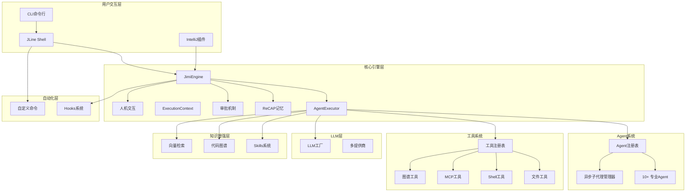
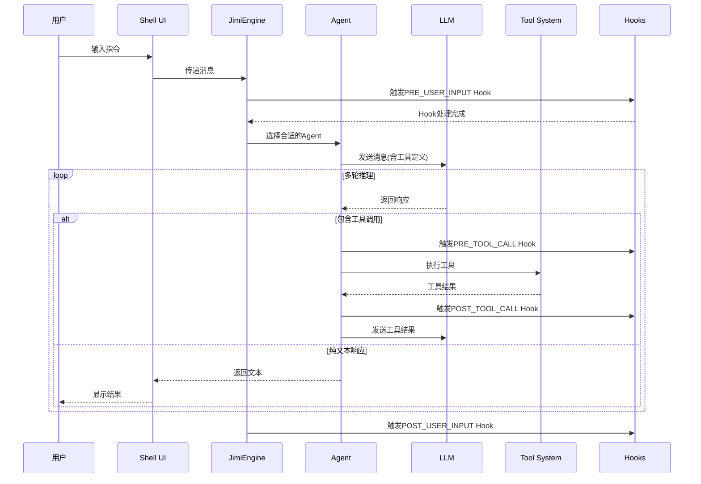

# Jimi：打造Java程序员专属的开源ClaudeCode

[](https://smithery.ai/skills?ns=leavesfly&utm_source=github&utm_medium=badge)


> 一个完全用Java实现的AI驱动CLI智能代理系统，为Java开发者带来可深度定制的类ClaudeCode开源。

[](https://www.oracle.com/java/)
[](https://spring.io/projects/spring-boot)
[](LICENSE)
[](https://github.com/leavesfly/Jimi)

---

## 📋 目录

- [✨ 特性亮点](#-特性亮点)
- [🎯 快速开始](#-快速开始)
- [🏛️ 架构设计](#️-架构设计)
- [📦 核心功能](#-核心功能)
- [🛠️ 扩展开发](#️-扩展开发)
- [📚 文档资料](#-文档资料)
- [🤝 贡献指南](#-贡献指南)

---

## ✨ 特性亮点

### 🤖 多Agent智能协作

Jimi提供10+个专业Agent，覆盖软件开发全流程：

| Agent | 职责 | 适用场景 |
|-------|-----|---------|
| **Default-Agent** | 通用开发助手 | 日常编码、问题解答 |
| **Design-Agent** | 架构设计专家 | 需求分析、系统设计、技术选型 |
| **Code-Agent** | 编码实现专家 | 代码生成、重构、优化 |
| **Review-Agent** | 代码审查专家 | 质量检查、安全审计、最佳实践 |
| **Build-Agent** | 构建管理专家 | Maven/Gradle构建、依赖管理 |
| **Test-Agent** | 测试工程师 | 单元测试、集成测试编写与执行 |
| **Debug-Agent** | 调试专家 | 错误诊断、问题修复 |
| **Doc-Agent** | 文档编写专家 | API文档、技术文档生成 |
| **Research-Agent** | 技术研究员 | 技术调研、方案对比 |
| **DevOps-Agent** | 运维专家 | 部署、监控、CI/CD |

**独特优势**：
- ✅ **异步子代理**：支持后台独立运行，主对话不阻塞
- ✅ **动态切换**：任务自动委派给最合适的专业Agent
- ✅ **上下文传递**：父子Agent间智能记忆传递
- ✅ **YAML配置**：无需编码，轻松自定义Agent

### 🪝 Hooks自动化系统

基于事件驱动的自动化机制，让工作流更智能：

```yaml
# 示例：保存Java文件后自动格式化
name: "auto-format-java"
description: "保存Java文件后自动格式化"
enabled: true
priority: 10

trigger:
  type: "POST_TOOL_CALL"
  tools: ["WriteFile", "StrReplaceFile"]
  file_patterns: ["*.java"]

execution:
  type: "script"
  script: |
    #!/bin/bash
    for file in ${MODIFIED_FILES}; do
      google-java-format -i "$file"
      echo "✅ 已格式化: $file"
    done
```

**支持的Hook类型**：
- `PRE_TOOL_CALL` / `POST_TOOL_CALL` - 工具执行前后
- `PRE_AGENT_SWITCH` / `POST_AGENT_SWITCH` - Agent切换时
- `ON_ERROR` - 错误发生时自动修复
- `ON_SESSION_START` / `ON_SESSION_END` - 会话生命周期

**核心特性**：
- ✅ 条件执行：支持环境变量、文件存在、脚本条件
- ✅ 变量替换：`${JIMI_WORK_DIR}` `${MODIFIED_FILES}` 等
- ✅ 优先级控制：按priority排序执行
- ✅ 热加载：修改配置无需重启

📖 **详细文档**：[docs/HOOKS.md](docs/HOOKS.md)

### 🔍 代码图谱系统

基于LocAgent论文的代码理解能力，支持精准代码导航：

```bash
# 构建代码图
/graph build

# 查看统计
/graph stats

# 自然语言查询
"找到GraphManager类的调用关系"
```

**核心能力**：
- ✅ **AST解析**：Java代码抽象语法树构建
- ✅ **混合检索**：图检索 + 向量检索融合
- ✅ **影响分析**：分析代码修改的上下游影响
- ✅ **调用图查询**：方法调用链可视化
- ✅ **智能定位**：自然语言快速定位代码

**工具集成**：
- `CodeLocateTool` - 智能代码定位
- `ImpactAnalysisTool` - 影响分析
- `CallGraphTool` - 调用图查询

📖 **详细文档**：[docs/GRAPH_GUIDE.md](docs/GRAPH_GUIDE.md)

### ⚡ 自定义命令系统

无需编写Java代码，通过YAML即可扩展命令：

```yaml
name: "quick-build"
description: "快速构建并运行测试"
category: "build"
aliases: ["qb"]

parameters:
  - name: "skip-tests"
    type: "boolean"
    defaultValue: "false"

execution:
  type: "script"
  script: |
    #!/bin/bash
    if [ "$SKIP_TESTS" = "true" ]; then
      mvn clean install -DskipTests
    else
      mvn clean install
    fi
  timeout: 300

preconditions:
  - type: "file_exists"
    path: "pom.xml"
```

**命令类型**：
- **Script** - 执行Shell脚本
- **Agent** - 委托给Agent执行
- **Composite** - 组合多个步骤

📖 **详细文档**：[docs/CUSTOM_COMMANDS.md](docs/CUSTOM_COMMANDS.md)

### 🧠 ReCAP记忆优化

基于NeurIPS 2025论文实现的智能上下文管理：

**核心机制**：
- ✅ **有界活动提示**：保持提示大小O(1)，避免无限增长
- ✅ **结构化恢复**：父子Agent间语义连续性
- ✅ **关键发现压缩**：智能提取和滑窗管理
- ✅ **Token优化**：节省30-50%的Token消耗

**配置示例**：
```yaml
jimi:
  memory:
    activePromptMaxTokens: 4000
    insightsWindowSize: 5
    enableRecap: true
    maxRecursionDepth: 5
```

📖 **详细文档**：[docs/ReCAP记忆优化技术方案.md](docs/ReCAP记忆优化技术方案.md)

### 🧩 Skills技能包系统

领域知识模块化管理，按需激活注入：

```
~/.jimi/skills/
├── code-review/          # 代码审查指南
│   └── SKILL.md
├── unit-testing/         # 单元测试规范
│   └── SKILL.md
└── custom-skill/         # 自定义技能
    └── SKILL.md
```

**特性**：
- ✅ 关键词自动匹配激活
- ✅ 团队知识共享复用
- ✅ 高性能缓存（Caffeine）
- ✅ 支持全局和项目级Skill

📖 **详细文档**：[docs/SKILLS_README.md](docs/SKILLS_README.md)

### 🌐 RAG检索增强

本地化向量索引，提升代码理解能力：

```bash
# 构建索引
/index build src/main/java

# 查询相关代码
/index query 如何处理用户认证

# 查看统计
/index stats
```

**工作原理**：
1. 代码分块（支持重叠窗口）
2. 向量化（本地嵌入模型）
3. 相似度搜索
4. TopK结果注入上下文

📖 **详细文档**：[docs/RAG配置指南.md](docs/RAG配置指南.md)

### 🔌 LLM多模型支持

集成主流LLM提供商，灵活切换：

| 提供商 | 模型示例 | 特点 |
|--------|---------|------|
| **OpenAI** | gpt-4, gpt-3.5-turbo | 强大的通用能力 |
| **Moonshot** | moonshot-v1-8k/32k | 中文友好 |
| **Qwen** | qwen-max, qwen-turbo | 阿里通义千问 |
| **DeepSeek** | deepseek-chat | 高性价比 |
| **Claude** | claude-3-opus/sonnet | Anthropic模型 |
| **Ollama** | llama2, codellama | 本地部署 |

**配置示例**：
```json
{
  "llm": {
    "providers": {
      "moonshot": {
        "apiKey": "your-api-key",
        "baseUrl": "https://api.moonshot.cn/v1"
      }
    },
    "defaultProvider": "moonshot",
    "defaultModel": "moonshot-v1-8k"
  }
}
```

### 🌐 MCP协议集成

支持Model Context Protocol标准，轻松集成外部工具：

```json
{
  "name": "mcp-git",
  "description": "Git操作服务",
  "type": "stdio",
  "config": {
    "command": "npx",
    "args": ["-y", "@modelcontextprotocol/server-git"]
  }
}
```

**内置示例**：
- `mcp-filesystem` - 文件系统访问
- `mcp-git` - Git操作
- `mcp-github` - GitHub API
- `mcp-database` - 数据库访问

### 🛠️ 丰富的工具生态

**文件操作**：
- `ReadFile` - 读取文件内容
- `WriteFile` - 写入文件
- `SearchFiles` - 搜索文件
- `PatchFile` - 应用补丁

**Shell执行**：
- `Bash` - 执行Shell命令
- 支持后台任务、超时控制

**网络工具**：
- `FetchURL` - 抓取网页内容
- `SearchWeb` - 网络搜索

**任务管理**：
- `ManageTodo` - 待办事项管理
- `Task` - 子Agent任务委托（同步）
- `AsyncTask` - 异步子Agent（后台运行）

**人机交互**：
- `AskHuman` - 执行中暂停等待用户输入

**代码图谱**：
- `CodeLocate` - 智能代码定位
- `ImpactAnalysis` - 影响分析
- `CallGraph` - 调用图查询

### 🔐 企业级特性

**审批机制**：
- 敏感操作人工审批
- 批量审批模式
- 审批历史记录

**YOLO模式**：
- 自动批准所有操作
- 适合可信环境

**循环控制**：
- 最大步数限制
- 运行时间限制
- 防止无限循环

**会话管理**：
- 会话持久化
- 断点恢复
- 历史回溯

**上下文压缩**：
- 智能消息压缩
- 保留关键信息
- Token优化

---

## 🎯 快速开始

### 环境要求

- **Java**: 17 或更高版本
- **Maven**: 3.6 或更高版本
- **操作系统**: macOS、Linux 或 Windows

### 一键安装

```bash
# 1. 克隆项目
git clone https://github.com/leavesfly/Jimi.git
cd Jimi

# 2. 一键安装（推荐）
./scripts/quick-install.sh
```

脚本会自动完成：
1. ✅ 环境检查
2. ✅ 依赖安装
3. ✅ 项目构建
4. ✅ 配置初始化
5. ✅ 启动服务

### 分步安装

#### 1. 检查环境

```bash
./scripts/check-env.sh
```

#### 2. 构建项目

```bash
# 快速构建（跳过测试）
./scripts/build.sh --skip-tests

# 完整构建
./scripts/build.sh
```

#### 3. 初始化配置

```bash
./scripts/init-config.sh
```

配置向导会引导您完成：
- LLM服务提供商选择
- API Key配置
- 模型选择
- 高级参数设置

#### 4. 启动Jimi

```bash
./scripts/start.sh

# 指定Agent启动
./scripts/start.sh --agent design

# YOLO模式（自动批准）
./scripts/start.sh --yolo

# 指定工作目录
./scripts/start.sh --work-dir /path/to/project
```

### 首次使用

启动后，尝试以下命令：

```bash
# 查看帮助
/help

# 查看可用工具
/tools

# 查看Agent列表
/agents

# 开始对话
你好，请帮我分析一下这个Java项目的结构
```

### 常用命令速查

| 命令 | 说明 |
|------|------|
| `/help` | 显示帮助信息 |
| `/status` | 查看系统状态 |
| `/config` | 显示配置信息 |
| `/tools` | 列出可用工具 |
| `/agents` | 列出可用Agent |
| `/history` | 查看命令历史 |
| `/reset` | 清除上下文 |
| `/compact` | 压缩上下文 |
| `/graph build` | 构建代码图 |
| `/hooks list` | 列出Hooks |
| `/commands list` | 列出自定义命令 |
| `/async list` | 列出异步子代理 |

---

## 🏛️ 架构设计

### 系统整体架构



### 核心执行流程



### 技术栈

**核心框架**
- Java 17+
- Spring Boot 3.2.5
- WebFlux（响应式编程）

**命令行交互**
- Picocli 4.7.6（参数解析）
- JLine 3.25.1（Shell实现）

**数据处理**
- Jackson 2.16.2（JSON）
- SnakeYAML 2.2（YAML）

**工具库**
- Apache Commons Exec（进程执行）
- Jsoup 1.17.2（HTML解析）
- Caffeine 3.1.8（缓存）
- Java Diff Utils 4.12（补丁）

**协议集成**
- MCP SDK 0.12.1

**IDE集成**
- Kotlin（IntelliJ插件）
- Gradle（插件构建）

---

## 📦 核心功能

### 1. 多Agent协作

#### 使用专业Agent

```bash
# 通过命令行指定
./scripts/start.sh --agent design

# 运行中切换
/switch design

# 任务自动委派
"请用设计Agent帮我设计一个用户认证模块"
```

#### 自定义Agent

创建 `~/.jimi/agents/my-agent/agent.yaml`：

```yaml
name: My Custom Agent
description: 我的自定义Agent
model: gpt-4
temperature: 0.7

subagents:
  - code
  - review

tools:
  - read_file
  - write_to_file
  - bash

skills:
  - code-review
```

创建系统提示词 `system_prompt.md`：

```markdown
你是一个专业的XXX专家...
```

### 2. Hooks自动化

#### 创建Hook

在 `~/.jimi/hooks/` 目录下创建 `my-hook.yaml`：

```yaml
name: "my-automation"
description: "我的自动化Hook"
enabled: true
priority: 50

trigger:
  type: "POST_TOOL_CALL"
  tools: ["WriteFile"]

execution:
  type: "script"
  script: |
    echo "文件已修改: ${MODIFIED_FILE}"
    # 执行你的自动化逻辑
```

#### Hook类型示例

**自动测试**
```yaml
trigger:
  type: "POST_TOOL_CALL"
  tools: ["WriteFile"]
  file_patterns: ["*Test.java"]

execution:
  type: "script"
  script: |
    mvn test -Dtest=${MODIFIED_FILE%.*}
```

**代码提交检查**
```yaml
trigger:
  type: "PRE_TOOL_CALL"
  tools: ["Bash"]

conditions:
  - type: "tool_result_contains"
    pattern: "git commit"

execution:
  type: "composite"
  steps:
    - type: "script"
      script: "mvn test"
    - type: "script"
      script: "mvn checkstyle:check"
```

**错误自动修复**
```yaml
trigger:
  type: "ON_ERROR"
  errorPattern: ".*compilation error.*"

execution:
  type: "agent"
  agent: "Code-Agent"
  task: "分析编译错误并自动修复: ${ERROR_MESSAGE}"
```

### 3. 代码图谱

#### 构建和查询

```bash
# 构建代码图
/graph build

# 查看统计信息
/graph stats
统计信息:
  实体数: 1523
  关系数: 3847
  文件数: 286

# 重新构建
/graph rebuild

# 清空图谱
/graph clear
```

#### Agent工具调用

```
用户: "找到GraphManager类的定义位置"
Agent: [调用CodeLocateTool]
结果: 
  - 类: io.leavesfly.jimi.knowledge.graph.GraphManager
  - 文件: src/main/java/.../GraphManager.java
  - 行号: 23-456

用户: "分析修改GraphBuilder的影响范围"
Agent: [调用ImpactAnalysisTool]
结果: 下游依赖分析
  - GraphManager (直接依赖)
  - GraphCommand (间接依赖)
  ...
```

### 4. 自定义命令

#### 快速构建命令

`~/.jimi/commands/quick-build.yaml`：

```yaml
name: "quick-build"
description: "快速构建项目"
category: "build"
aliases: ["qb"]

parameters:
  - name: "skip-tests"
    type: "boolean"
    defaultValue: "false"
    description: "是否跳过测试"

execution:
  type: "script"
  script: |
    #!/bin/bash
    set -e
    
    echo "🔨 开始构建..."
    
    if [ "$SKIP_TESTS" = "true" ]; then
      mvn clean install -DskipTests
    else
      mvn clean install
    fi
    
    echo "✅ 构建完成!"
  timeout: 300

preconditions:
  - type: "file_exists"
    path: "pom.xml"
    errorMessage: "不是Maven项目"
```

使用：

```bash
/quick-build
/qb --skip-tests
```

#### Git工作流命令

`~/.jimi/commands/git-workflow.yaml`：

```yaml
name: "git-commit-all"
description: "添加、提交并推送"
category: "git"
aliases: ["gca"]

parameters:
  - name: "message"
    type: "string"
    required: true
    description: "提交信息"

execution:
  type: "composite"
  steps:
    - type: "script"
      script: "git add ."
      description: "添加所有更改"
    
    - type: "script"
      script: 'git commit -m "${MESSAGE}"'
      description: "提交更改"
    
    - type: "script"
      script: "git push"
      description: "推送到远程"

preconditions:
  - type: "dir_exists"
    path: ".git"
```

### 5. 异步子代理

#### 启动后台任务

```
用户: "帮我在后台运行构建任务"

Agent: [调用AsyncTask]
{
  "subagent_name": "Build-Agent",
  "prompt": "执行 mvn clean install",
  "mode": "fire_and_forget",
  "timeout_seconds": 600
}

返回:
异步子代理已启动
- ID: a1b2c3d4
- 名称: Build-Agent
- 模式: 后台运行

使用 /async status a1b2c3d4 查看状态
```

#### 管理异步任务

```bash
# 列出活跃的异步任务
/async list

# 查看任务状态
/async status a1b2c3d4

# 取消任务
/async cancel a1b2c3d4

# 获取任务结果
/async result a1b2c3d4
```

### 6. Skills技能包

#### 使用内置Skill

```
用户: "帮我review这段代码"

# code-review Skill自动激活
触发词匹配: ["code review", "review", "审查"]

Agent上下文中自动注入:
---
## 代码审查最佳实践

1. 代码规范检查
   - 命名规范
   - 格式规范
   - 注释规范

2. 逻辑审查
   - 业务逻辑正确性
   - 边界条件处理
   - 异常处理

...
---
```

#### 创建自定义Skill

`~/.jimi/skills/my-skill/SKILL.md`：

```markdown
---
name: my-skill
description: 我的自定义技能
version: 1.0.0
category: custom
triggers:
  - my-keyword
  - custom-feature
---

# 我的技能包

这里是技能的详细内容...

## 使用规范

1. ...
2. ...
```

### 7. RAG向量检索

#### 构建索引

```bash
# 为当前项目构建索引
/index build

# 为指定目录构建
/index build src/main/java

# 自定义分块参数
/index build --chunk-size=100 --overlap=10
```

#### 查询索引

```bash
# 查询相关代码
/index query Agent执行流程

# 查看统计
/index stats
索引统计:
  片段数: 1234
  文件数: 286
  向量维度: 384
```

#### 自动检索增强

启用后，每次对话自动检索相关代码注入上下文：

```json
{
  "vector_index": {
    "enabled": true,
    "top_k": 5
  }
}
```

```
用户: "上下文压缩是如何触发的?"

[自动检索]
检索到5个相关片段:
- AgentExecutor.java:194-233 (压缩检查与触发)
- SimpleCompaction.java:77-140 (压缩实现)
...

Jimi: 基于检索到的代码，上下文压缩在以下情况触发...
```

### 8. MCP工具集成

#### 配置MCP服务

`~/.jimi/mcp/mcp-github.json`：

```json
{
  "name": "mcp-github",
  "description": "GitHub API服务",
  "type": "stdio",
  "config": {
    "command": "npx",
    "args": [
      "-y",
      "@modelcontextprotocol/server-github"
    ],
    "env": {
      "GITHUB_TOKEN": "your-token"
    }
  }
}
```

#### 启动时加载

```bash
./scripts/start.sh --mcp-config-file ~/.jimi/mcp/mcp-github.json
```

#### Agent调用MCP工具

```
用户: "帮我创建一个GitHub issue"

Agent: [调用MCP工具: github_create_issue]
{
  "repo": "leavesfly/Jimi",
  "title": "Feature request",
  "body": "..."
}
```

---

## 🛠️ 扩展开发

### 开发自定义工具

#### 1. 实现Tool接口

```java
@Component
public class MyCustomTool extends AbstractTool<MyCustomTool.Params> {
    
    @Data
    @Builder
    public static class Params {
        @JsonProperty("param1")
        @JsonPropertyDescription("参数1说明")
        private String param1;
    }
    
    public MyCustomTool() {
        super("my_custom_tool", 
              "我的自定义工具", 
              Params.class);
    }
    
    @Override
    public Mono<ToolResult> execute(Params params) {
        // 工具逻辑实现
        String result = processLogic(params.getParam1());
        return Mono.just(ToolResult.ok(result, "执行成功"));
    }
    
    private String processLogic(String input) {
        // 具体业务逻辑
        return "处理结果: " + input;
    }
}
```

#### 2. 创建ToolProvider

```java
@Component
public class MyToolProvider implements ToolProvider {
    
    @Override
    public List<Tool> getTools(ToolRegistry registry) {
        return List.of(
            new MyCustomTool()
        );
    }
}
```

Spring会自动注册工具到ToolRegistry。

### 开发自定义Agent

#### 1. 创建Agent配置

`~/.jimi/agents/my-agent/agent.yaml`：

```yaml
name: My Expert Agent
description: 专注于XXX领域的专家Agent
model: gpt-4
temperature: 0.7
max_tokens: 4000

# 可用的子Agent
subagents:
  - code
  - review
  - test

# 可用的工具
tools:
  - read_file
  - write_to_file
  - bash
  - my_custom_tool

# 激活的技能包
skills:
  - code-review
  - my-skill
```

#### 2. 编写系统提示词

`~/.jimi/agents/my-agent/system_prompt.md`：

```markdown
你是一个专业的XXX领域专家,具备以下能力:

## 核心职责
1. ...
2. ...

## 工作流程
1. 分析需求
2. 制定方案
3. 实施执行
4. 质量验证

## 注意事项
- 始终遵循最佳实践
- 注重代码质量
- 考虑性能优化

当前工作目录: ${JIMI_WORK_DIR}
```

#### 3. 使用自定义Agent

```bash
./scripts/start.sh --agent my-agent
```

### 开发自定义命令

参见[核心功能 - 自定义命令](#4-自定义命令)章节。

### 开发Hooks

参见[核心功能 - Hooks自动化](#2-hooks自动化)章节。

### 开发Skills

参见[核心功能 - Skills技能包](#6-skills技能包)章节。

### IntelliJ插件开发

#### 构建插件

```bash
cd intellij-plugin
./gradlew buildPlugin
```

#### 运行调试

```bash
./gradlew runIde
```

#### 安装插件

1. 打开IDEA → Settings → Plugins
2. 齿轮图标 → Install Plugin from Disk
3. 选择 `build/distributions/jimi-intellij-plugin-0.1.0.zip`

📖 **详细文档**：[intellij-plugin/README.md](intellij-plugin/README.md)

---

## 📚 文档资料

### 核心文档

| 文档 | 说明 |
|------|------|
| [用户使用指南.md](用户使用指南.md) | 完整的用户手册 |
| [HOOKS.md](docs/HOOKS.md) | Hooks系统完整指南 |
| [GRAPH_GUIDE.md](docs/GRAPH_GUIDE.md) | 代码图谱使用指南 |
| [CUSTOM_COMMANDS.md](docs/CUSTOM_COMMANDS.md) | 自定义命令指南 |
| [ReCAP记忆优化技术方案.md](docs/ReCAP记忆优化技术方案.md) | 记忆优化技术方案 |
| [async-subagent-design.md](docs/async-subagent-design.md) | 异步子代理设计 |
| [RAG配置指南.md](docs/RAG配置指南.md) | 向量检索配置 |
| [SKILLS_README.md](docs/SKILLS_README.md) | Skills系统说明 |
| [MCP_INTEGRATION_REPORT.md](docs/MCP_INTEGRATION_REPORT.md) | MCP集成报告 |
| [TECHNICAL_ARCHITECTURE.md](docs/TECHNICAL_ARCHITECTURE.md) | 技术架构文档 |

### 设计文档

| 文档 | 说明 |
|------|------|
| [GRAPH_PERSISTENCE.md](docs/GRAPH_PERSISTENCE.md) | 图谱持久化设计 |
| [CURSOR_INTEGRATION.md](docs/CURSOR_INTEGRATION.md) | Cursor集成方案 |
| [intellij-plugin-integration-plan.md](docs/intellij-plugin-integration-plan.md) | IntelliJ插件集成计划 |

### 脚本工具

| 脚本 | 说明 |
|------|------|
| [scripts/quick-install.sh](scripts/quick-install.sh) | 一键安装 |
| [scripts/build.sh](scripts/build.sh) | 项目构建 |
| [scripts/start.sh](scripts/start.sh) | 启动服务 |
| [scripts/check-env.sh](scripts/check-env.sh) | 环境检查 |
| [scripts/init-config.sh](scripts/init-config.sh) | 配置初始化 |

### 示例配置

查看 `src/main/resources/` 目录：

- `agents/` - Agent配置示例
- `commands/` - 自定义命令示例
- `hooks/` - Hooks配置示例
- `mcp/` - MCP服务配置示例
- `skills/` - Skills示例

---

## 🤝 贡献指南

我们欢迎所有形式的贡献！

### 贡献方式

1. **代码贡献**
   - Fork项目
   - 创建特性分支
   - 提交Pull Request

2. **文档改进**
   - 修正错误
   - 补充说明
   - 翻译文档

3. **问题反馈**
   - 提交Issue
   - 详细描述问题
   - 提供复现步骤

4. **功能建议**
   - 描述使用场景
   - 说明预期效果
   - 讨论实现方案

### 开发规范

- 遵循Java编码规范
- 编写单元测试
- 更新相关文档
- 保持向后兼容

### 提交Pull Request

```bash
# 1. Fork并克隆
git clone https://github.com/your-username/Jimi.git
cd Jimi

# 2. 创建分支
git checkout -b feature/my-feature

# 3. 开发和测试
mvn clean test

# 4. 提交更改
git commit -m "feat: add my feature"

# 5. 推送分支
git push origin feature/my-feature

# 6. 创建Pull Request
```

### 社区规范

- 尊重他人
- 建设性讨论
- 遵守[行为准则](CODE_OF_CONDUCT.md)

---

## 💬 社区支持

### 获取帮助

- 📖 查阅[文档](docs/)
- 💡 搜索[Issues](https://github.com/leavesfly/Jimi/issues)
- 💬 参与[Discussions](https://github.com/leavesfly/Jimi/discussions)

### 联系方式

- **GitHub Issues**: 报告问题和建议
- **Discussions**: 技术讨论和交流
- **Email**: support@leavesfly.io

### Star History

如果Jimi对你有帮助，请给我们一个Star ⭐️

[](https://star-history.com/#leavesfly/Jimi&Date)

---

## 📜 许可证

本项目采用 [Apache License 2.0](LICENSE) 许可证。

---

<div align="center">

**[⬆ 回到顶部](#jimi-java程序员的智能ai编程助手)**

Made with ❤️ by [Leavesfly](https://github.com/leavesfly)

</div>
