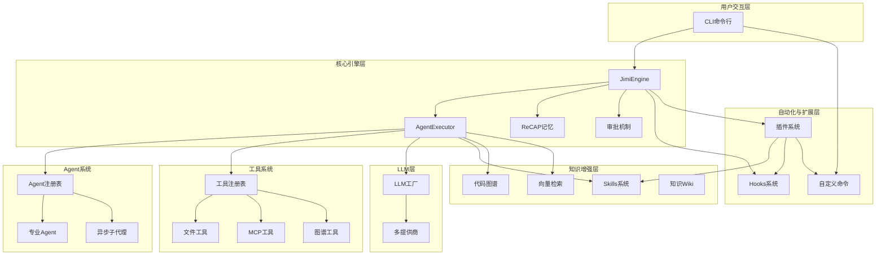

# Jimi - 打造Java程序员专属的ClaudeCode

> 纯Java实现的AI驱动智能代理系统，为Java开发者提供类ClaudeCode体验的开源CLI工具

[](https://www.oracle.com/java/)
[](https://spring.io/projects/spring-boot)
[](LICENSE)

## 📋 目录

- [核心特性](#-核心特性)
- [快速开始](#-快速开始)
- [系统架构](#-系统架构)
- [使用指南](#-使用指南)
- [扩展开发](#-扩展开发)
- [插件系统](#-插件系统)
- [文档资源](#-文档资源)

## ✨ 核心特性

### 🤖 多Agent智能协作

内置6个专业Agent覆盖开发全流程：

| Agent | 职责 |
|-------|------|
| **Default** | 通用开发助手 |
| **Architect** | 架构设计 |
| **Code** | 编码实现 |
| **Quality** | 代码质量与审查 |
| **Doc** | 文档编写 |
| **DevOps** | 部署运维 |

- 异步子代理：后台任务不阻塞主对话
- 动态切换：智能委派最合适的Agent
- YAML配置：无需编码自定义Agent

### 🧩 Skills技能包

内置6个开发技能包，领域知识模块化管理：

| 技能包 | 功能 |
|-------|------|
| api-design | API设计规范 |
| code-quality-suite | 代码质量套件 |
| database-design | 数据库设计 |
| git-commit-guide | Git提交规范 |
| java-best-practices | Java最佳实践 |
| unit-testing | 单元测试 |

关键词自动激活，按需加载到上下文。

### 🪝 Hooks自动化系统

事件驱动的工作流自动化：

```yaml
name: "auto-format-java"
trigger:
  type: "POST_TOOL_CALL"
  tools: ["WriteFile"]
  file_patterns: ["*.java"]
execution:
  type: "script"
  script: "google-java-format -i ${MODIFIED_FILES}"
```

支持 **15 种 Hook 事件**（对齐 Claude Code 9 种 + Jimi 扩展 3 种 + Agent Teams 扩展 3 种），覆盖工具调用前后、Agent 切换、会话开始/结束、错误处理等多种触发时机。[详细文档](docs/HOOKS.md)

### 🔍 代码图谱系统

基于AST的代码理解与导航：

- AST解析：Java代码结构化分析
- 混合检索：图检索 + 向量检索
- 影响分析：代码修改影响范围评估
- 智能定位：自然语言快速定位代码

[详细文档](docs/GRAPH_GUIDE.md)

### ⚡ 自定义命令

YAML配置即可扩展命令：

```yaml
name: "quick-build"
aliases: ["qb"]
execution:
  type: "script"
  script: "mvn clean install"
```

支持Script、Agent、Composite三种执行类型。[详细文档](docs/CUSTOM_COMMANDS.md)

### 🧠 智能记忆管理

基于ReCAP论文的上下文优化：

- 有界活动提示：防止上下文无限增长
- 结构化恢复：父子Agent语义连续
- Token优化：节省30-50% Token消耗

### 🌐 RAG检索增强

本地向量索引，自动检索相关代码注入上下文。[详细文档](docs/RAG配置指南.md)

### 🔌 多模型支持

通过统一的 `ChatProvider` 抽象支持 9 种 Provider：`openai`、`kimi`（Moonshot）、`qwen`（通义千问）、`deepseek`、`claude`、`ollama`、`glm`（智谱）、`minimax`、`cursor`。基于 OpenAI 兼容协议，支持流式响应、Caffeine 缓存、Token 估算与限流。

### 🌐 MCP协议集成

支持Model Context Protocol，集成外部工具服务（Git、GitHub、Database等）。

### 🛠️ 丰富工具生态

内置 **18 个原生工具** + MCP 动态工具，覆盖六大类：

- **文件操作**（5）：`ReadFile`、`WriteFile`、`StrReplaceFile`、`Grep`、`Glob`
- **Shell执行**（1）：`BashTool` 命令执行、后台任务
- **网络工具**（2）：`FetchURL` 网页抓取、`WebSearch` 搜索
- **代码图谱**（3）：`CodeLocate` 智能定位、`CallGraph` 调用链、`ImpactAnalysis` 影响分析
- **任务管理**（2）：`SubAgent` 同步/异步子代理、`TeamAgent` 团队协作
- **知识与交互**（5）：`Memory`、`Skills`、`SetTodoList`、`AskHuman`、`MetaTool`

所有工具基于响应式（Reactor `Mono`）执行，支持并发安全控制与 JSON Schema 自动生成。

### 📦 插件系统

将 **Skills / Hooks / Commands / MCP / Agents** 五种扩展点打包成统一可分发单元：

- **一键安装**：`/plugin install owner/repo` 从 GitHub、URL 或本地目录安装
- **可版本化**：`compatibility.jimi_version` 版本门禁，`VersionRange` 语义化匹配
- **可审计**：`provides` 白名单显式声明对外暴露的扩展项
- **三层作用域**：classpath（内置）< user（用户级）< project（项目级）

[详细文档](docs/PLUGIN_DEVELOPMENT.md)

### 🔐 企业级特性

- 审批机制：敏感操作人工审批
- YOLO模式：自动批准所有操作
- 循环控制：防止无限循环
- 会话管理：持久化与断点恢复
- 上下文压缩：智能Token优化

## 🎯 快速开始

### 环境要求

- Java 17+
- Maven 3.6+
- macOS / Linux / Windows

### 快速安装

```bash
git clone https://github.com/leavesfly/Jimi.git
cd Jimi
./scripts/quick-install.sh
```

### 分步安装

```bash
# 1. 检查环境
./scripts/check-env.sh

# 2. 构建项目
./scripts/build.sh

# 3. 初始化配置
./scripts/init-config.sh

# 4. 启动Jimi
./scripts/start.sh

# 指定Agent启动
./scripts/start.sh --agent architect

# YOLO模式（自动批准所有操作）
./scripts/start.sh --yolo
```

### 命令行参数

`CliApplication`（基于 Picocli）支持以下选项：

| 参数 | 说明 |
|------|------|
| `-w, --work-dir <path>` | 指定工作目录（默认当前目录） |
| `-m, --model <name>` | 覆盖使用的模型（优先级高于 Agent 与全局配置） |
| `-C, --continue` | 继续上次会话（按工作目录恢复 `lastSessionId`） |
| `-y, --yolo, --yes` | YOLO 模式：自动批准所有工具调用（慎用） |
| `--agent-file <path>` | 指定自定义 Agent 规范文件（YAML） |
| `--mcp-config-file <path>` | 额外加载 MCP 服务配置（可重复指定） |
| `-c, --command <text>` | 非交互式：执行单条命令后退出（脚本友好） |
| `--verbose` | 打印详细启动信息 |
| `--debug` | 启用调试日志（LLM 请求/响应、工具调用） |

### 常用命令

| 命令 | 说明 |
|------|------|
| `/help` | 帮助信息 |
| `/status` | 系统状态 |
| `/tools` | 工具列表 |
| `/agents` | Agent列表 |
| `/switch <agent>` | 切换当前 Agent |
| `/skills` | 技能包列表 |
| `/graph build` | 构建代码图 |
| `/hooks list` | Hooks列表 |
| `/plugin list` | 插件列表 |
| `/async list` | 异步任务 |
| `/memory` | 记忆管理 |
| `/reset` | 清除上下文 |
| `/config` | 查看配置 |
| `/version` | 版本信息 |

## 🏛️ 系统架构


```mermaid
graph TB
    subgraph 用户交互层
        CLI[CLI命令行]
    end
    
    subgraph 核心引擎层
        Engine[JimiEngine]
        Executor[AgentExecutor]
        Memory[ReCAP记忆]
        Approval[审批机制]
    end
    
    subgraph Agent系统
        AgentRegistry[Agent注册表]
        MultiAgents[专业Agent]
        AsyncMgr[异步子代理]
    end
    
    subgraph 知识增强层
        Skills[Skills系统]
        Graph[代码图谱]
        RAG[向量检索]
        Wiki[知识Wiki]
    end
    
    subgraph 自动化与扩展层
        Hooks[Hooks系统]
        Commands[自定义命令]
        Plugins[插件系统]
    end
    
    subgraph 工具系统
        ToolRegistry[工具注册表]
        FileTools[文件工具]
        MCPTools[MCP工具]
        GraphTools[图谱工具]
    end
    
    subgraph LLM层
        LLMFactory[LLM工厂]
        Providers[多提供商]
    end
    
    CLI --> Engine
    Engine --> Executor
    Engine --> Memory
    Engine --> Approval
    Executor --> AgentRegistry
    Executor --> ToolRegistry
    Executor --> LLMFactory
    AgentRegistry --> MultiAgents
    AgentRegistry --> AsyncMgr
    Executor --> Skills
    Executor --> Graph
    Executor --> RAG
    Engine --> Hooks
    CLI --> Commands
    Engine --> Plugins
    Plugins --> Skills
    Plugins --> Hooks
    Plugins --> Commands
    ToolRegistry --> FileTools
    ToolRegistry --> MCPTools
    ToolRegistry --> GraphTools
    LLMFactory --> Providers
```

### 技术栈

| 类别 | 技术 |
|------|------|
| **核心框架** | Spring Boot 3.2.10, WebFlux + Reactor Netty |
| **命令行** | Picocli 4.7.6, JLine 3.25.1 |
| **数据处理** | Jackson 2.17.0, SnakeYAML 2.2 |
| **代码分析** | JavaParser + symbol-solver 3.26.4 |
| **协议集成** | MCP SDK 0.12.1 |
| **进程/文本** | Commons Exec 1.4.0, Commons Text 1.11.0, Jsoup 1.17.2 |
| **缓存** | Caffeine 3.2.0 |

## 📚 使用指南

### 配置 LLM

Jimi 的配置文件位于 **`~/.jimi/config.yml`**（YAML 格式，注意后缀是 `.yml`）。首次使用建议将内置默认配置 `src/main/resources/.jimi/config.yml` 拷贝到 `~/.jimi/config.yml`，再按需修改 `api_key`。

一份最小可用配置示例：

```yaml
# 默认模型（必须在 models 中已定义）
default_model: qwen3-max

providers:
  qwen:
    type: qwen                                                   # ProviderType 枚举之一
    base_url: https://dashscope.aliyuncs.com/compatible-mode/v1
    api_key: sk-xxxxxxxxxxxxxxxx
    rate_limit:                                                  # 可选：限流
      window_ms: 4000
      max_requests: 4
      sleep_ms: 3000

models:
  qwen3-max:
    provider: qwen                                               # 对应 providers 的某个 key
    model: qwen3-max                                             # 发给 LLM API 的真实模型名
    max_context_size: 200000                                     # 上下文窗口（Token）
```

`type` 支持：`kimi` / `deepseek` / `qwen` / `ollama` / `openai` / `claude` / `cursor` / `glm` / `minimax`。

### Agent使用

```bash
# 切换Agent
/switch architect

# 查看Agent列表
/agents

# 使用指定Agent启动
./scripts/start.sh --agent code
```

自定义Agent：在`~/.jimi/agents/`目录下创建`agent.yaml`和`system_prompt.md`文件。

### Hooks自动化

在`~/.jimi/hooks/`目录下创建YAML配置文件：

```yaml
name: "auto-test"
trigger:
  type: "POST_TOOL_CALL"
  tools: ["WriteFile"]
  file_patterns: ["*Test.java"]
execution:
  type: "script"
  script: "mvn test -Dtest=${MODIFIED_FILE%.*}"
```

[详细文档](docs/HOOKS.md)

### 代码图谱

```bash
# 构建图谱
/graph build

# 查看统计
/graph stats

# 自然语言查询
"找到GraphManager类的定义位置"
```

[详细文档](docs/GRAPH_GUIDE.md)

### 自定义命令

在`~/.jimi/commands/`创建YAML配置：

```yaml
name: "quick-build"
aliases: ["qb"]
execution:
  type: "script"
  script: "mvn clean install"
```

[详细文档](docs/CUSTOM_COMMANDS.md)

### 异步任务

```bash
# 查看异步任务
/async list

# 查看状态
/async status <task_id>

# 取消任务
/async cancel <task_id>
```

## 📦 插件系统

插件将 **Skills / Hooks / Commands / MCP / Agents** 五种扩展点打包成一个有版本号、有清单、可整体安装/卸载/升级的分发单元。

### 安装与管理

```bash
# 从 GitHub 安装（支持 owner/repo#branch）
/plugin install leavesfly/java-dev-kit

# 从本地目录或 ZIP 安装
/plugin install ./my-plugin
/plugin install ./my-plugin.zip

# 列表 / 详情 / 启用 / 禁用 / 卸载
/plugin list
/plugin info <name>
/plugin enable <name>
/plugin disable <name>
/plugin uninstall <name>
```

### 插件清单 plugin.yaml

```yaml
name: java-dev-kit
version: 1.0.0
description: Java 开发全家桶

compatibility:
  jimi_version: ">=0.1.0"      # 版本门禁（VersionRange 语义匹配）

provides:                       # 对外暴露的扩展项白名单
  skills: ["java-best-practices"]
  hooks: ["auto-format-java"]
  commands: ["quick-build"]

defaults:
  modules:                      # 模块级开关，支持灰度启用
    skills: true
    hooks: true
```

插件遵循 **classpath（内置）< user（`~/.jimi/plugins/`）< project（`<project>/.jimi/plugins/`）** 三层作用域，同名后加载覆盖。[详细文档](docs/PLUGIN_DEVELOPMENT.md)

## 🛠️ 扩展开发

### 自定义工具

```java
@Component
public class MyTool extends AbstractTool<MyTool.Params> {
    @Data
    public static class Params {
        @JsonProperty("input")
        private String input;
    }
    
    public MyTool() {
        super("my_tool", "我的工具", Params.class);
    }
    
    @Override
    public Mono<ToolResult> execute(Params params) {
        return Mono.just(ToolResult.ok("结果"));
    }
}
```

### 自定义Agent

在`~/.jimi/agents/my-agent/`创建配置文件：

**agent.yaml**
```yaml
name: My Agent
model: qwen3-max          # 对应 config.yml 中 models 已定义的模型名（留空则用 default_model）
tools:
  - ReadFile
  - WriteFile
  - my_tool
```

**system_prompt.md**
```markdown
你是一个专业的开发助手...
```

### 自定义Skill

在`~/.jimi/skills/<name>/`创建`SKILL.md`（Markdown + YAML Front Matter），按触发词自动激活并注入 system prompt：

```markdown
---
name: java-best-practices
description: Java 编码最佳实践
triggers: ["最佳实践", "代码规范", "重构"]
---

# Java 最佳实践
- 优先使用不可变对象...
```

### 自定义命令

在`~/.jimi/commands/`创建YAML配置，支持四种执行类型：
- **script**: 执行Shell脚本
- **agent**: 调用Agent执行
- **composite**: 组合多个命令
- **prompt**: 固定 prompt 模板

> 提示：单个小能力用上述扩展点；当扩展项超过 2 个或需要团队共享，建议升级为 [插件](#-插件系统) 统一分发。

### 用户视角文档（docs/）

| 文档 | 说明 |
|------|------|
| [用户使用指南](用户使用指南.md) | 完整用户手册 |
| [HOOKS](docs/HOOKS.md) | Hooks系统指南 |
| [代码图谱](docs/GRAPH_GUIDE.md) | 代码图谱指南 |
| [自定义命令](docs/CUSTOM_COMMANDS.md) | 命令扩展指南 |
| [RAG配置](docs/RAG配置指南.md) | 检索增强配置 |
| [插件开发](docs/PLUGIN_DEVELOPMENT.md) | 插件开发手册 |
| [技术架构](docs/TECHNICAL_ARCHITECTURE.md) | 系统架构详解 |
| [架构总览](docs/ARCHITECTURE_OVERVIEW.md) | 架构概览 |

### 开发者视角文档（wiki/）

深入源码、用于理解机制、定位代码与二次扩展，详见 **[Wiki 首页](wiki/Home.md)**：

| Wiki | 主题 |
|------|------|
| [01 · 项目概述与快速开始](wiki/01-项目概述与快速开始.md) | 项目定位、技术栈、上手 |
| [02 · 系统架构与核心引擎](wiki/02-系统架构与核心引擎.md) | JimiEngine / AgentExecutor / ReactLoop |
| [03 · Agent 多智能体系统](wiki/03-Agent多智能体系统.md) | Agent、AgentRegistry、异步 Subagent、Team |
| [04 · 工具系统与 ToolRegistry](wiki/04-工具系统与ToolRegistry.md) | Tool SPI、18 个内置工具、MCP 动态工具 |
| [05 · LLM 接入层与多模型支持](wiki/05-LLM接入层与多模型支持.md) | ChatProvider、流式、缓存、限流 |
| [06 · Skills 技能包系统](wiki/06-Skills技能包系统.md) | 技能包规范、触发词、渐进式披露 |
| [07 · Hooks 自动化系统](wiki/07-Hooks自动化系统.md) | 15 种 Hook 事件、触发器与执行器 |
| [08 · 代码图谱与 RAG 检索](wiki/08-代码图谱与RAG检索.md) | AST、混合检索、影响分析 |
| [09 · 自定义命令与 CLI 交互](wiki/09-自定义命令与CLI交互.md) | 元命令、4 种执行类型、JLine Shell |
| [10 · 记忆管理与会话机制](wiki/10-记忆管理与会话机制.md) | 三层记忆、ReCAP 压缩、审批与 YOLO |
| [11 · MCP 协议集成](wiki/11-MCP协议集成.md) | MCP 客户端、stdio/http 传输 |
| [12 · 扩展开发指南](wiki/12-扩展开发指南.md) | 自定义 Tool/Agent/Skill/Hook/Command |
| [13 · 插件系统与扩展分发](wiki/13-插件系统与扩展分发.md) | PluginRegistry、安装器、版本范围 |

## 🤝 贡献指南

欢迎贡献！

```bash
# Fork并克隆
git clone https://github.com/your-username/Jimi.git

# 创建分支
git checkout -b feature/my-feature

# 开发和测试
mvn clean test

# 提交更改
git commit -m "feat: add my feature"

# 推送并创建Pull Request
git push origin feature/my-feature
```

### 开发规范

- 遵循Java编码规范
- 编写单元测试
- 更新相关文档
- 保持向后兼容

## 📜 许可证

本项目采用 [Apache License 2.0](LICENSE) 许可证。

---

<div align="center">

**[⬆ 回到顶部](#jimi---打造java程序员专属的claudecode)**

Made with ❤️ by [Leavesfly](https://github.com/leavesfly)

</div>
