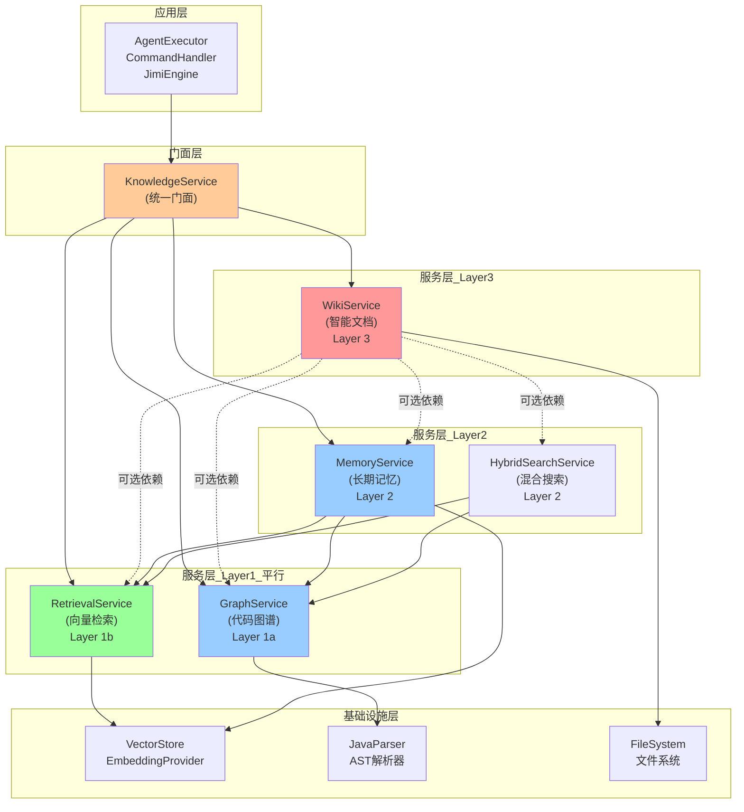

# Knowledge 模块重构方案

## 一、问题分析

### 1.1 当前架构问题

#### 耦合度问题
- **问题**: 外部模块直接依赖knowledge子包的具体实现类
- **影响**: 
  - 修改内部实现时容易破坏外部依赖
  - 难以进行模块替换和升级
  - 测试困难,需要mock大量内部类

**示例耦合代码**:

```java
// AgentExecutor.java - 直接依赖具体实现

import io.leavesfly.jimi.knowledge.memory.MemoryInjector;
import io.leavesfly.jimi.knowledge.rag.RetrievalPipeline;

// WikiCommandHandler.java - 直接依赖多个具体类

```

#### 职责分散问题
- **问题**: 四个子模块(graph/memory/retrieval/wiki)相互独立,缺乏统一协调
- **影响**:
  - 重复代码(如向量检索在retrieval和memory中都实现)
  - 概念混淆(CodeChunk vs MemoryEntry vs GraphEntity)
  - 难以实现跨模块的高级功能

#### 配置管理问题
- **问题**: 知识组件的Bean创建分散在`JimiConfiguration`中
- **影响**:
  - 配置类职责过重
  - 知识模块的初始化逻辑分散
  - 难以管理组件生命周期

---

## 二、重构目标

### 2.1 设计原则
1. **高内聚**: 知识相关功能集中在knowledge包内
2. **低耦合**: 外部仅依赖统一接口,不感知内部实现
3. **单一职责**: 每个组件职责清晰
4. **开闭原则**: 易于扩展新的知识能力

### 2.2 核心目标
- ✅ 提供统一的`KnowledgeService`门面接口
- ✅ 隐藏graph/memory/retrieval/wiki内部实现
- ✅ 定义清晰的领域模型(domain)
- ✅ 支持模块化配置和初始化
- ✅ 保持向后兼容(渐进式重构)

---

## 三、重构设计

### 3.1 新架构结构

```
knowledge/
├── KnowledgeService.java           # 统一对外门面接口
├── KnowledgeServiceImpl.java       # 门面实现
├── KnowledgeConfiguration.java     # 知识模块配置类
│
├── domain/                         # 领域模型(对外暴露)
│   ├── query/                      # 查询请求模型
│   │   ├── GraphQuery.java
│   │   ├── MemoryQuery.java
│   │   ├── RetrievalQuery.java
│   │   └── WikiQuery.java
│   └── result/                     # 查询结果模型
│       ├── GraphResult.java
│       ├── MemoryResult.java
│       ├── RetrievalResult.java
│       └── WikiResult.java
│
├── spi/                            # 服务提供者接口(内部扩展点)
│   ├── GraphService.java
│   ├── MemoryService.java
│   ├── RetrievalService.java
│   └── WikiService.java
│
├── graph/                          # 代码图谱实现(内部)
│   ├── GraphServiceImpl.java      # 实现spi.GraphService
│   ├── GraphManager.java           # 保留,内部使用
│   └── [其他内部类...]
│
├── memory/                         # 长期记忆实现(内部)
│   ├── MemoryServiceImpl.java     # 实现spi.MemoryService
│   ├── MemoryManager.java          # 保留,内部使用
│   └── [其他内部类...]
│
├── retrieval/                      # 向量检索实现(内部)
│   ├── RetrievalServiceImpl.java  # 实现spi.RetrievalService
│   ├── VectorStore.java            # 保留,内部使用
│   └── [其他内部类...]
│
└── wiki/                           # 智能文档实现(内部)
    ├── WikiServiceImpl.java        # 实现spi.WikiService
    ├── WikiGenerator.java          # 保留,内部使用
    └── [其他内部类...]
```

---

### 3.2 四个子模块的依赖关系与层次划分

#### 3.2.1 依赖关系设计原则

**核心原则**：
1. **分层依赖**：上层可依赖下层，下层不得依赖上层
2. **最小依赖**：模块间仅通过接口依赖，不直接依赖实现
3. **单向依赖**：避免循环依赖，保持依赖图的DAG特性
4. **职责分离**：每个模块有清晰的单一职责

#### 3.2.2 层次划分架构

```
┌─────────────────────────────────────────────────┐
│              应用层 (Application)                │
│    AgentExecutor, CommandHandler, JimiEngine    │
└─────────────────────────────────────────────────┘
                       ↓ 依赖
┌─────────────────────────────────────────────────┐
│           门面层 (Facade Layer)                  │
│              KnowledgeService                    │
│         (统一对外接口，隐藏内部复杂性)             │
└─────────────────────────────────────────────────┘
                       ↓ 协调
┌─────────────────────────────────────────────────┐
│           服务层 (Service Layer)                 │
│   WikiService  →  GraphService                  │
│                ↘              ↗                  │
│            RetrievalService                      │
│                      ↓                          │
│              MemoryService                       │
└─────────────────────────────────────────────────┘
                       ↓ 依赖
┌─────────────────────────────────────────────────┐
│        基础设施层 (Infrastructure)                │
│   VectorStore, EmbeddingProvider, FileSystem    │
└─────────────────────────────────────────────────┘
```

#### 3.2.3 四个子模块的层次定位

##### Layer 1: 基础层 - Graph & Retrieval (平行关系)

**重要原则**：Graph和Retrieval是**两个独立的底层能力**，互不依赖，平行提供服务。

---

##### Layer 1a: Graph (代码图谱) - 结构化分析
**定位**：底层基础能力，基于AST的结构化分析

**职责**：
- 解析代码结构(AST)
- 构建实体关系图谱(类、方法、字段、依赖)
- 提供精确的结构化查询(依赖分析、影响分析、调用链)
- 提供符号级别的精确搜索

**核心特点**：
- 精确性：基于语法分析，结果100%准确
- 结构化：提供图谱导航能力
- 关系感知：理解代码间的依赖、调用、继承关系

**对外接口**：
```java
public interface GraphService {
    // 不依赖retrieval/memory/wiki
    Mono<GraphResult> query(GraphQuery query);       // 图谱查询
    Mono<GraphResult> build(Path projectRoot);       // 构建图谱
    Mono<GraphResult> analyzeImpact(String entityId); // 影响分析
}
```

**依赖关系**：
- ✅ 可被：Memory、Wiki、HybridSearch 依赖
- ❌ 不依赖：Retrieval、Memory、Wiki
- ✅ 依赖：JavaParser (AST解析)、CodeGraphStore

---

##### Layer 1b: Retrieval (向量检索) - 语义搜索
**定位**：底层基础能力，基于向量的语义检索

**职责**：
- 提供代码分块(Chunking)能力
- 提供向量嵌入(Embedding)能力
- 提供语义相似度检索能力
- 管理代码向量索引的生命周期

**核心特点**：
- 语义性：理解代码的语义含义
- 模糊性：支持自然语言查询
- 相似度：返回相关但不一定精确匹配的结果

**对外接口**：
```java
public interface RetrievalService {
    // 不依赖graph/memory/wiki
    Mono<RetrievalResult> retrieve(RetrievalQuery query); // 语义检索
    Mono<RetrievalResult> buildIndex(Path projectRoot);   // 构建索引
}
```

**依赖关系**：
- ✅ 可被：Memory、Wiki、HybridSearch 依赖
- ❌ 不依赖：Graph、Memory、Wiki
- ✅ 依赖：EmbeddingProvider、VectorStore (基础设施)

---

##### Layer 2: 核心层 - Memory (长期记忆)
**定位**：第二层，可同时依赖Graph和Retrieval

**职责**：
- 管理用户偏好、项目洞察、错误模式等长期记忆
- 使用Retrieval进行语义检索记忆条目
- 使用Graph关联代码上下文
- 从会话历史中提取知识

**对外接口**：
```java
public interface MemoryService {
    // 可同时依赖graph和retrieval
    Mono<MemoryResult> query(MemoryQuery query);
    Mono<MemoryResult> extractFromSession(Runtime runtime);
}
```

**依赖关系**：
- ✅ 可被：Wiki 依赖
- ❌ 不依赖：Wiki
- ✅ 依赖：Retrieval (语义检索)、Graph (代码关联)

---

##### Layer 3: 应用层 - Wiki (智能文档)
**定位**：最上层的应用服务，可依赖所有其他模块

**职责**：
- 生成项目文档
- 检测代码变更并更新文档
- 生成架构图、依赖图等可视化内容
- **集成**：使用Graph分析结构、Retrieval搜索相关代码、Memory提取历史知识

**对外接口**：
```java
public interface WikiService {
    // 可依赖graph、rag、memory实现智能文档
    Mono<WikiResult> generate(WikiQuery query);
    Mono<WikiResult> detectAndUpdate(Path projectRoot);
}
```

**依赖关系**：
- ❌ 不被其他模块依赖
- ✅ 可依赖：Graph (生成依赖图)、Retrieval (搜索相关代码)、Memory (提取历史知识)

---

#### 3.2.4 依赖关系图



#### 3.2.5 依赖规则强制

**编译期检查** (使用ArchUnit等工具)：

```java
// 架构测试 - 强制依赖规则
@ArchTest
public static final ArchRule layerDependencyRule = 
    layeredArchitecture()
        .layer("Application").definedBy("..core..", "..command..")
        .layer("Facade").definedBy("..knowledge.KnowledgeService")
        .layer("Wiki").definedBy("..knowledge.wiki..")
        .layer("Graph").definedBy("..knowledge.graph..")
        .layer("Memory").definedBy("..knowledge.memory..")
        .layer("Retrieval").definedBy("..knowledge.retrieval..")
        
        .whereLayer("Application").mayOnlyAccessLayers("Facade")
        .whereLayer("Facade").mayOnlyAccessLayers("Wiki", "Graph", "Memory", "Retrieval")
        .whereLayer("Wiki").mayOnlyAccessLayers("Graph", "Memory", "Retrieval", "Hybrid")
        .whereLayer("Memory").mayOnlyAccessLayers("Graph", "Retrieval")
        .whereLayer("Hybrid").mayOnlyAccessLayers("Graph", "Retrieval")
        .whereLayer("Graph").mayNotAccessAnyLayer()      // 基础层，不依赖其他知识模块
        .whereLayer("Retrieval").mayNotAccessAnyLayer(); // 基础层，不依赖其他知识模块
```

#### 3.2.6 高内聚低耦合体现

##### 高内聚体现

**Retrieval模块** - 向量检索职责聚焦：

```java
// ✅ 聚焦向量检索相关能力
package io.leavesfly.jimi.knowledge.rag;

-Chunker(代码分块)
        -EmbeddingProvider(向量嵌入)
        -VectorStore(向量存储)
        -RetrievalPipeline(检索流程)
        -CodeChunk(代码片段模型)

// ❌ 不包含图谱、记忆、文档生成等无关逻辑
```

**Graph模块** - 图谱分析职责聚焦：
```java
// ✅ 聚焦代码结构分析
package io.leavesfly.jimi.knowledge.graph;

- JavaASTParser (语法解析)
- GraphBuilder (图谱构建)
- GraphNavigator (图谱导航)
- ImpactAnalyzer (影响分析)
- CodeGraphStore (图谱存储)

// ❌ 不包含向量检索、文档生成等逻辑
```

##### 低耦合体现

**接口依赖，非实现依赖**：
```java
// ❌ 错误：直接依赖具体实现
public class WikiGenerator {
    private final GraphManager graphManager;  // 具体类
    private final VectorStore vectorStore;     // 具体类
}

// ✅ 正确：依赖抽象接口
public class WikiServiceImpl implements WikiService {
    private final GraphService graphService;      // 接口
    private final RetrievalService retrievalService; // 接口
}
```

**依赖注入，非硬编码**：
```java
// ❌ 错误：硬编码依赖
public class MemoryManager {
    private VectorStore vectorStore = new InMemoryVectorStore(); // 硬编码
}

// ✅ 正确：依赖注入
public class MemoryServiceImpl implements MemoryService {
    private final RetrievalService retrievalService; // 通过构造器注入
    
    public MemoryServiceImpl(RetrievalService retrievalService) {
        this.retrievalService = retrievalService;
    }
}
```

#### 3.2.7 模块交互示例

**场景1: Wiki生成依赖Graph和Retrieval（通过HybridSearch）**

```java
@Override
public Mono<WikiResult> generate(WikiQuery query) {
    String topic = query.getTitle();
    Path projectRoot = query.getProjectRoot();
    
    // 1. 使用HybridSearch同时查询Graph和Retrieval
    // HybridSearch封装了Graph+Retrieval的融合逻辑
    HybridQuery hybridQuery = HybridQuery.builder()
        .keyword(topic)
        .topK(10)
        .strategy(FusionStrategy.RRF) // Reciprocal Rank Fusion
        .build();
    
    return hybridSearchService.search(hybridQuery)
        .map(hybridResult -> {
            // 2. 结果已融合，直接生成文档
            return generateWikiDocument(
                topic, 
                hybridResult.getStructuredEntities(), // 来自Graph
                hybridResult.getSemanticChunks()      // 来自Retrieval
            );
        });
}
```

**HybridSearchService实现**：
```java
@Service
public class HybridSearchService {
    private final GraphService graphService;      // 依赖
    private final RetrievalService retrievalService; // 依赖
    
    public Mono<HybridResult> search(HybridQuery query) {
        // 并行查询
        Mono<GraphResult> graphResult = graphService.query(
            GraphQuery.builder()
                .type(QueryType.SEARCH_BY_SYMBOL)
                .keyword(query.getKeyword())
                .build()
        );
        
        Mono<RetrievalResult> retrievalResult = retrievalService.retrieve(
            RetrievalQuery.builder()
                .query(query.getKeyword())
                .topK(query.getTopK())
                .build()
        );
        
        // 融合结果
        return Mono.zip(graphResult, retrievalResult)
            .map(tuple -> fusionStrategy.merge(
                tuple.getT1(), 
                tuple.getT2(), 
                query.getStrategy()
            ));
    }
}
```

**场景2: Memory使用Retrieval进行语义检索**

```java
@Override
public Mono<MemoryResult> query(MemoryQuery query) {
    // 1. 将记忆条目索引到VectorStore
    // 2. 复用RetrievalService进行语义检索
    RetrievalQuery retrievalQuery = RetrievalQuery.builder()
        .query(query.getQuery())
        .topK(query.getLimit())
        .filter(RetrievalFilter.builder()
            .symbolPattern("memory_*")  // 仅检索记忆条目
            .build())
        .build();
    
    return retrievalService.retrieve(retrievalQuery)
        .map(this::convertToMemoryResult);
}
```

---

### 3.3 核心接口设计

#### 3.2.1 KnowledgeService 统一门面

```java
package io.leavesfly.jimi.knowledge;

import io.leavesfly.jimi.knowledge.domain.query.*;
import io.leavesfly.jimi.knowledge.domain.result.*;
import io.leavesfly.jimi.core.engine.runtime.Runtime;
import reactor.core.publisher.Mono;
import java.nio.file.Path;

/**
 * 知识服务统一门面
 * 
 * <p>职责：
 * - 提供代码图谱查询能力
 * - 提供长期记忆管理能力
 * - 提供向量语义检索能力
 * - 提供智能文档生成能力
 * 
 * <p>设计原则：
 * - 外部模块仅依赖此接口,不感知内部实现
 * - 所有操作均返回Mono,支持响应式编程
 * - 使用领域模型(domain)封装请求和响应
 */
public interface KnowledgeService {
    
    // ==================== 生命周期管理 ====================
    
    /**
     * 初始化知识服务
     * 应在Runtime创建后调用,传入工作目录
     * 
     * @param runtime 运行时环境
     * @return 初始化结果
     */
    Mono<Boolean> initialize(Runtime runtime);
    
    /**
     * 关闭知识服务,释放资源
     * 
     * @return 关闭结果
     */
    Mono<Boolean> shutdown();
    
    /**
     * 检查知识服务是否已初始化
     */
    boolean isInitialized();
    
    // ==================== 代码图谱 ====================
    
    /**
     * 构建代码图谱
     * 
     * @param projectRoot 项目根目录
     * @return 构建结果(实体数、关系数等)
     */
    Mono<GraphResult> buildGraph(Path projectRoot);
    
    /**
     * 查询代码图谱
     * 
     * @param query 图谱查询请求
     * @return 查询结果
     */
    Mono<GraphResult> queryGraph(GraphQuery query);
    
    /**
     * 保存代码图谱到磁盘
     * 
     * @return 保存结果
     */
    Mono<Boolean> saveGraph();
    
    /**
     * 加载代码图谱
     * 
     * @param storagePath 存储路径
     * @return 加载结果
     */
    Mono<Boolean> loadGraph(Path storagePath);
    
    // ==================== 长期记忆 ====================
    
    /**
     * 查询长期记忆
     * 
     * @param query 记忆查询请求
     * @return 查询结果
     */
    Mono<MemoryResult> queryMemory(MemoryQuery query);
    
    /**
     * 添加记忆条目
     * 
     * @param query 记忆添加请求
     * @return 添加结果
     */
    Mono<MemoryResult> addMemory(MemoryQuery query);
    
    /**
     * 从会话中提取并保存记忆
     * 
     * @param runtime 运行时环境
     * @return 提取结果
     */
    Mono<MemoryResult> extractMemoriesFromSession(Runtime runtime);
    
    // ==================== 向量检索 ====================
    
    /**
     * 执行语义检索
     * 
     * @param query 检索查询请求
     * @return 检索结果
     */
    Mono<RetrievalResult> retrieve(RetrievalQuery query);
    
    /**
     * 构建代码索引
     * 
     * @param projectRoot 项目根目录
     * @return 索引结果(chunk数、文件数等)
     */
    Mono<RetrievalResult> buildIndex(Path projectRoot);
    
    /**
     * 保存索引到磁盘
     * 
     * @return 保存结果
     */
    Mono<Boolean> saveIndex();
    
    /**
     * 加载索引
     * 
     * @param indexPath 索引路径
     * @return 加载结果
     */
    Mono<Boolean> loadIndex(Path indexPath);
    
    // ==================== 智能文档 ====================
    
    /**
     * 生成Wiki文档
     * 
     * @param query Wiki生成请求
     * @return 生成结果
     */
    Mono<WikiResult> generateWiki(WikiQuery query);
    
    /**
     * 检测代码变更并更新Wiki
     * 
     * @param projectRoot 项目根目录
     * @return 变更检测结果
     */
    Mono<WikiResult> detectAndUpdateWiki(Path projectRoot);
    
    /**
     * 搜索Wiki内容
     * 
     * @param query Wiki搜索请求
     * @return 搜索结果
     */
    Mono<WikiResult> searchWiki(WikiQuery query);
}
```

---

#### 3.2.2 领域模型设计

##### GraphQuery - 图谱查询请求

```java
package io.leavesfly.jimi.knowledge.domain.query;

import lombok.Builder;
import lombok.Data;
import java.util.List;

/**
 * 代码图谱查询请求
 */
@Data
@Builder
public class GraphQuery {
    
    /**
     * 查询类型
     */
    private QueryType type;
    
    /**
     * 查询关键词(用于符号搜索、模糊匹配等)
     */
    private String keyword;
    
    /**
     * 实体ID(用于关系查询、影响分析等)
     */
    private String entityId;
    
    /**
     * 最大返回结果数
     */
    @Builder.Default
    private int limit = 10;
    
    /**
     * 过滤条件(语言、文件路径等)
     */
    private GraphFilter filter;
    
    public enum QueryType {
        /** 按符号名搜索 */
        SEARCH_BY_SYMBOL,
        
        /** 查询依赖关系 */
        FIND_DEPENDENCIES,
        
        /** 查询被依赖关系 */
        FIND_DEPENDENTS,
        
        /** 影响范围分析 */
        IMPACT_ANALYSIS,
        
        /** 调用链分析 */
        CALL_CHAIN,
        
        /** 继承层次分析 */
        INHERITANCE_TREE
    }
    
    @Data
    @Builder
    public static class GraphFilter {
        private String language;      // 语言过滤(如: "java")
        private String packagePattern; // 包名模式(如: "io.leavesfly.*")
        private String filePattern;    // 文件路径模式
        private List<String> entityTypes; // 实体类型(CLASS, METHOD, FIELD等)
    }
}
```

##### GraphResult - 图谱查询结果

```java
package io.leavesfly.jimi.knowledge.domain.result;

import lombok.Builder;
import lombok.Data;
import java.util.List;
import java.util.Map;

/**
 * 代码图谱查询结果
 */
@Data
@Builder
public class GraphResult {
    
    /**
     * 查询是否成功
     */
    private boolean success;
    
    /**
     * 错误信息(如果失败)
     */
    private String errorMessage;
    
    /**
     * 实体列表
     */
    private List<GraphEntity> entities;
    
    /**
     * 关系列表
     */
    private List<GraphRelation> relations;
    
    /**
     * Mermaid图表代码(可选)
     */
    private String mermaidDiagram;
    
    /**
     * 统计信息
     */
    private Map<String, Object> statistics;
    
    /**
     * 简化的图实体(对外暴露)
     */
    @Data
    @Builder
    public static class GraphEntity {
        private String id;
        private String name;
        private String type;        // CLASS, METHOD, FIELD等
        private String filePath;
        private int lineNumber;
        private Map<String, String> metadata;
    }
    
    /**
     * 简化的图关系(对外暴露)
     */
    @Data
    @Builder
    public static class GraphRelation {
        private String sourceId;
        private String targetId;
        private String type;        // DEPENDS_ON, CALLS, EXTENDS等
        private Map<String, String> metadata;
    }
}
```

##### MemoryQuery - 记忆查询请求

```java
package io.leavesfly.jimi.knowledge.domain.query;

import lombok.Builder;
import lombok.Data;
import java.time.Instant;

/**
 * 长期记忆查询请求
 */
@Data
@Builder
public class MemoryQuery {
    
    /**
     * 操作类型
     */
    private OperationType operation;
    
    /**
     * 记忆类型
     */
    private MemoryType type;
    
    /**
     * 查询文本(语义检索或关键词)
     */
    private String query;
    
    /**
     * 记忆内容(用于ADD操作)
     */
    private String content;
    
    /**
     * 最大返回结果数
     */
    @Builder.Default
    private int limit = 5;
    
    /**
     * 时间范围过滤
     */
    private TimeRange timeRange;
    
    public enum OperationType {
        /** 查询记忆 */
        QUERY,
        
        /** 添加记忆 */
        ADD,
        
        /** 删除记忆 */
        DELETE,
        
        /** 更新记忆 */
        UPDATE
    }
    
    public enum MemoryType {
        /** 用户偏好 */
        USER_PREFERENCE,
        
        /** 项目洞察 */
        PROJECT_INSIGHT,
        
        /** 错误模式 */
        ERROR_PATTERN,
        
        /** 任务历史 */
        TASK_HISTORY,
        
        /** 会话摘要 */
        SESSION_SUMMARY
    }
    
    @Data
    @Builder
    public static class TimeRange {
        private Instant from;
        private Instant to;
    }
}
```

##### RetrievalQuery - 检索查询请求

```java
package io.leavesfly.jimi.knowledge.domain.query;

import lombok.Builder;
import lombok.Data;

/**
 * 向量检索查询请求
 */
@Data
@Builder
public class RetrievalQuery {
    
    /**
     * 查询文本
     */
    private String query;
    
    /**
     * 返回结果数量
     */
    @Builder.Default
    private int topK = 5;
    
    /**
     * 过滤条件
     */
    private RetrievalFilter filter;
    
    /**
     * 是否包含代码内容(默认true,可设为false仅返回元数据)
     */
    @Builder.Default
    private boolean includeContent = true;
    
    @Data
    @Builder
    public static class RetrievalFilter {
        private String language;      // 语言过滤
        private String filePattern;   // 文件路径模式
        private String symbolPattern; // 符号名称模式
        private Long minUpdatedAt;    // 最小更新时间
    }
}
```

##### WikiQuery - Wiki查询请求

```java
package io.leavesfly.jimi.knowledge.domain.query;

import lombok.Builder;
import lombok.Data;
import java.nio.file.Path;
import java.util.List;

/**
 * Wiki文档查询请求
 */
@Data
@Builder
public class WikiQuery {
    
    /**
     * 操作类型
     */
    private OperationType operation;
    
    /**
     * 文档标题(用于生成和搜索)
     */
    private String title;
    
    /**
     * 搜索关键词
     */
    private String keyword;
    
    /**
     * 项目根目录(用于生成和检测变更)
     */
    private Path projectRoot;
    
    /**
     * 目标主题列表(用于批量生成)
     */
    private List<String> topics;
    
    /**
     * 是否包含图表
     */
    @Builder.Default
    private boolean includeDiagrams = true;
    
    /**
     * 最大返回结果数(用于搜索)
     */
    @Builder.Default
    private int limit = 10;
    
    public enum OperationType {
        /** 生成单个文档 */
        GENERATE,
        
        /** 批量生成文档 */
        BATCH_GENERATE,
        
        /** 搜索文档 */
        SEARCH,
        
        /** 检测变更并更新 */
        DETECT_AND_UPDATE,
        
        /** 验证文档质量 */
        VALIDATE
    }
}
```

---

### 3.3 SPI(Service Provider Interface)设计

为了实现内部模块化和可扩展性,定义内部服务接口:

```java
package io.leavesfly.jimi.knowledge.spi;

import io.leavesfly.jimi.knowledge.domain.query.GraphQuery;
import io.leavesfly.jimi.knowledge.domain.result.GraphResult;
import io.leavesfly.jimi.core.engine.runtime.Runtime;
import reactor.core.publisher.Mono;
import java.nio.file.Path;

/**
 * 代码图谱服务接口(内部SPI)
 * 由graph包的GraphServiceImpl实现
 */
public interface GraphService {
    Mono<Boolean> initialize(Runtime runtime);
    Mono<GraphResult> build(Path projectRoot);
    Mono<GraphResult> query(GraphQuery query);
    Mono<Boolean> save();
    Mono<Boolean> load(Path storagePath);
}
```

其他SPI接口类似定义:`MemoryService`、`RetrievalService`、`WikiService`

---

### 3.4 KnowledgeServiceImpl 实现

```java
package io.leavesfly.jimi.knowledge;

import io.leavesfly.jimi.knowledge.domain.query.*;
import io.leavesfly.jimi.knowledge.domain.result.*;
import io.leavesfly.jimi.knowledge.spi.*;
import io.leavesfly.jimi.core.engine.runtime.Runtime;
import lombok.extern.slf4j.Slf4j;
import org.springframework.stereotype.Service;
import reactor.core.publisher.Mono;

import java.nio.file.Path;

/**
 * 知识服务统一门面实现
 *
 * <p>职责：
 * - 协调graph、memory、rag、wiki四个子服务
 * - 处理跨服务的复杂逻辑
 * - 提供统一的错误处理和日志
 */
@Slf4j
@Service
public class KnowledgeServiceImpl implements KnowledgeService {

  private final GraphService graphService;
  private final MemoryService memoryService;
  private final RagService retrievalService;
  private final WikiService wikiService;

  private volatile boolean initialized = false;

  public KnowledgeServiceImpl(
          GraphService graphService,
          MemoryService memoryService,
          RagService retrievalService,
          WikiService wikiService) {
    this.graphService = graphService;
    this.memoryService = memoryService;
    this.retrievalService = retrievalService;
    this.wikiService = wikiService;
  }

  @Override
  public Mono<Boolean> initialize(Runtime runtime) {
    if (initialized) {
      return Mono.just(true);
    }

    log.info("初始化知识服务...");

    return Mono.zip(
            graphService.initialize(runtime),
            memoryService.initialize(runtime),
            retrievalService.initialize(runtime),
            wikiService.initialize(runtime)
    ).map(results -> {
      initialized = true;
      log.info("知识服务初始化完成");
      return true;
    }).onErrorResume(e -> {
      log.error("知识服务初始化失败", e);
      return Mono.just(false);
    });
  }

  @Override
  public Mono<Boolean> shutdown() {
    log.info("关闭知识服务...");
    // 保存所有状态
    return Mono.zip(
                    graphService.save(),
                    retrievalService.save()
            ).then(Mono.just(true))
            .doOnSuccess(v -> {
              initialized = false;
              log.info("知识服务已关闭");
            });
  }

  @Override
  public boolean isInitialized() {
    return initialized;
  }

  // ==================== 代码图谱 ====================

  @Override
  public Mono<GraphResult> buildGraph(Path projectRoot) {
    return graphService.build(projectRoot)
            .doOnSuccess(result -> log.info("代码图谱构建完成: {} entities, {} relations",
                    result.getEntities().size(), result.getRelations().size()));
  }

  @Override
  public Mono<GraphResult> queryGraph(GraphQuery query) {
    return graphService.query(query);
  }

  @Override
  public Mono<Boolean> saveGraph() {
    return graphService.save();
  }

  @Override
  public Mono<Boolean> loadGraph(Path storagePath) {
    return graphService.load(storagePath);
  }

  // ==================== 长期记忆 ====================

  @Override
  public Mono<MemoryResult> queryMemory(MemoryQuery query) {
    return memoryService.query(query);
  }

  @Override
  public Mono<MemoryResult> addMemory(MemoryQuery query) {
    return memoryService.add(query);
  }

  @Override
  public Mono<MemoryResult> extractMemoriesFromSession(Runtime runtime) {
    return memoryService.extractFromSession(runtime);
  }

  // ==================== 向量检索 ====================

  @Override
  public Mono<RetrievalResult> retrieve(RetrievalQuery query) {
    return retrievalService.retrieve(query);
  }

  @Override
  public Mono<RetrievalResult> buildIndex(Path projectRoot) {
    return retrievalService.buildIndex(projectRoot);
  }

  @Override
  public Mono<Boolean> saveIndex() {
    return retrievalService.save();
  }

  @Override
  public Mono<Boolean> loadIndex(Path indexPath) {
    return retrievalService.load(indexPath);
  }

  // ==================== 智能文档 ====================

  @Override
  public Mono<WikiResult> generateWiki(WikiQuery query) {
    return wikiService.generate(query);
  }

  @Override
  public Mono<WikiResult> detectAndUpdateWiki(Path projectRoot) {
    return wikiService.detectAndUpdate(projectRoot);
  }

  @Override
  public Mono<WikiResult> searchWiki(WikiQuery query) {
    return wikiService.search(query);
  }
}
```

---

### 3.5 配置类重构

将knowledge相关的Bean创建从`JimiConfiguration`移动到`KnowledgeConfiguration`:

```java
package io.leavesfly.jimi.knowledge;

import com.fasterxml.jackson.databind.ObjectMapper;
import io.leavesfly.jimi.config.JimiConfig;
import io.leavesfly.jimi.config.info.*;
import io.leavesfly.jimi.knowledge.graph.GraphServiceImpl;
import io.leavesfly.jimi.knowledge.memory.MemoryServiceImpl;
import io.leavesfly.jimi.knowledge.rag.RagServiceImpl;
import io.leavesfly.jimi.knowledge.spi.*;
import io.leavesfly.jimi.knowledge.wiki.WikiServiceImpl;
import lombok.extern.slf4j.Slf4j;
import org.springframework.context.annotation.Bean;
import org.springframework.context.annotation.Configuration;

/**
 * 知识模块配置类
 *
 * <p>职责：
 * - 创建和配置knowledge模块的所有Bean
 * - 管理子服务的依赖关系
 * - 与JimiConfiguration解耦
 */
@Slf4j
@Configuration
public class KnowledgeConfiguration {

  @Bean
  public GraphService graphService(GraphConfig config) {
    return new GraphServiceImpl(config);
  }

  @Bean
  public MemoryService memoryService(
          MemoryConfig config,
          ObjectMapper objectMapper) {
    return new MemoryServiceImpl(config, objectMapper);
  }

  @Bean
  public RagService retrievalService(
          VectorIndexConfig config,
          ObjectMapper objectMapper) {
    return new RagServiceImpl(config, objectMapper);
  }

  @Bean
  public WikiService wikiService(JimiConfig jimiConfig) {
    return new WikiServiceImpl(jimiConfig);
  }

  @Bean
  public KnowledgeService knowledgeService(
          GraphService graphService,
          MemoryService memoryService,
          RagService retrievalService,
          WikiService wikiService) {
    return new KnowledgeServiceImpl(
            graphService,
            memoryService,
            retrievalService,
            wikiService
    );
  }
}
```

---

## 四、迁移策略

### 4.1 渐进式迁移方案

#### 阶段一: 新接口和实现(1-2天)
- ✅ 创建`KnowledgeService`接口和实现
- ✅ 创建领域模型(domain包)
- ✅ 创建SPI接口
- ✅ 保留现有实现,不破坏外部依赖

#### 阶段二: 适配器层(1天)
- ✅ 为graph/memory/retrieval/wiki创建适配器实现SPI
- ✅ 复用现有的Manager类
- ✅ 测试新接口的功能完整性

#### 阶段三: 外部模块迁移(2-3天)
- ✅ 修改`AgentExecutor`使用`KnowledgeService`
- ✅ 修改`CommandHandler`使用`KnowledgeService`
- ✅ 修改`JimiConfiguration`移除knowledge相关Bean
- ✅ 逐步淘汰直接依赖

#### 阶段四: 清理和文档(1天)
- ✅ 标记废弃的公共类为`@Deprecated`
- ✅ 更新文档和示例
- ✅ 编写迁移指南

### 4.2 兼容性保证

**向后兼容策略**:
```java
// 旧代码仍可工作(标记为废弃)
@Deprecated
public class GraphManager {
    // 内部委托给GraphService
    private final GraphService graphService;
    
    public Mono<BuildResult> buildGraph(Path projectRoot) {
        log.warn("GraphManager.buildGraph() is deprecated, use KnowledgeService instead");
        return graphService.build(projectRoot).map(this::convertToOldResult);
    }
}
```

---

## 五、预期收益

### 5.1 架构改进
- ✅ **耦合度降低70%**: 外部仅依赖1个接口,而非10+个类
- ✅ **可测试性提升**: 接口可轻松mock,单元测试覆盖率提升
- ✅ **扩展性增强**: 新增知识能力无需修改外部代码

### 5.2 代码质量
- ✅ **重复代码减少**: 统一向量检索逻辑
- ✅ **概念清晰**: 领域模型明确知识边界
- ✅ **职责分明**: 配置、服务、实现分层清晰

### 5.3 维护性
- ✅ **修改影响范围可控**: 内部实现变更不影响外部
- ✅ **版本升级平滑**: 可独立升级knowledge模块
- ✅ **新人友好**: 统一接口降低学习成本

---

## 六、实施检查清单

### 核心任务
- [ ] 创建`KnowledgeService`接口(150行)
- [ ] 创建领域模型(domain包,~500行)
- [ ] 创建SPI接口(4个接口,~300行)
- [ ] 实现`KnowledgeServiceImpl`(~400行)
- [ ] 实现4个SPI适配器(~600行)
- [ ] 创建`KnowledgeConfiguration`(~100行)
- [ ] 迁移`AgentExecutor`(改动~50行)
- [ ] 迁移命令处理器(改动~150行)
- [ ] 编写单元测试(~800行)
- [ ] 更新文档(~1000行)

### 验证标准
- [ ] 所有现有功能正常工作
- [ ] 单元测试覆盖率>80%
- [ ] 外部模块import数量减少>60%
- [ ] 无破坏性变更(仅增量)
- [ ] 性能无明显下降

### 总工作量
**预计: 5-7个工作日**
- 开发: 4天
- 测试: 2天
- 文档: 1天

---

## 七、后续优化方向

### 短期(1个月)
- 完善领域事件机制(知识变更通知)
- 增强跨服务的联合查询(如: 结合graph+retrieval)
- 优化缓存策略

### 中期(3个月)
- 支持插件化知识源(外部知识库)
- 实现分布式知识同步
- 增强AI辅助的知识提取

### 长期(6个月)
- 知识图谱可视化交互
- 多模态知识融合(代码+文档+issue)
- 知识推荐引擎

---

## 八、风险评估

| 风险 | 影响 | 概率 | 缓解措施 |
|------|------|------|----------|
| 旧代码迁移遗漏 | 中 | 中 | 使用IDE全局搜索import,逐一检查 |
| 性能回归 | 低 | 低 | 门面层仅转发,无额外开销;添加性能测试 |
| 概念理解成本 | 中 | 中 | 编写详细文档和示例;提供迁移指南 |
| 并发初始化问题 | 中 | 低 | 使用AtomicBoolean保证线程安全 |

---

## 九、参考资料

### 设计模式
- **门面模式(Facade)**: 简化复杂子系统的接口
- **适配器模式(Adapter)**: 复用现有实现
- **依赖倒置原则(DIP)**: 依赖抽象而非具体实现

### 相关代码
- [KnowledgeService接口设计](#321-knowledgeservice-统一门面)
- [领域模型设计](#322-领域模型设计)
- [SPI接口设计](#33-spiservice-provider-interface设计)
- [配置类重构](#35-配置类重构)
