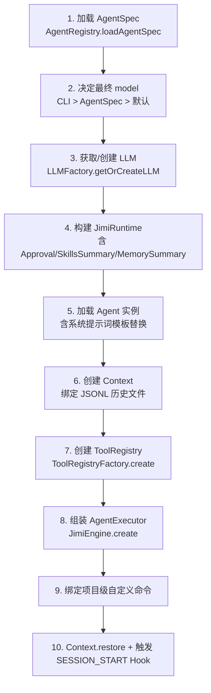
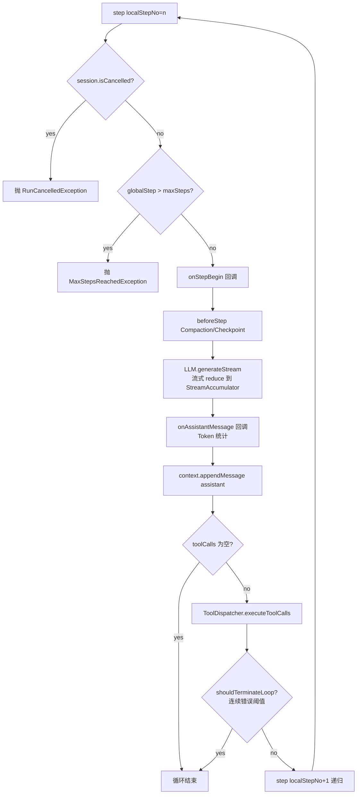
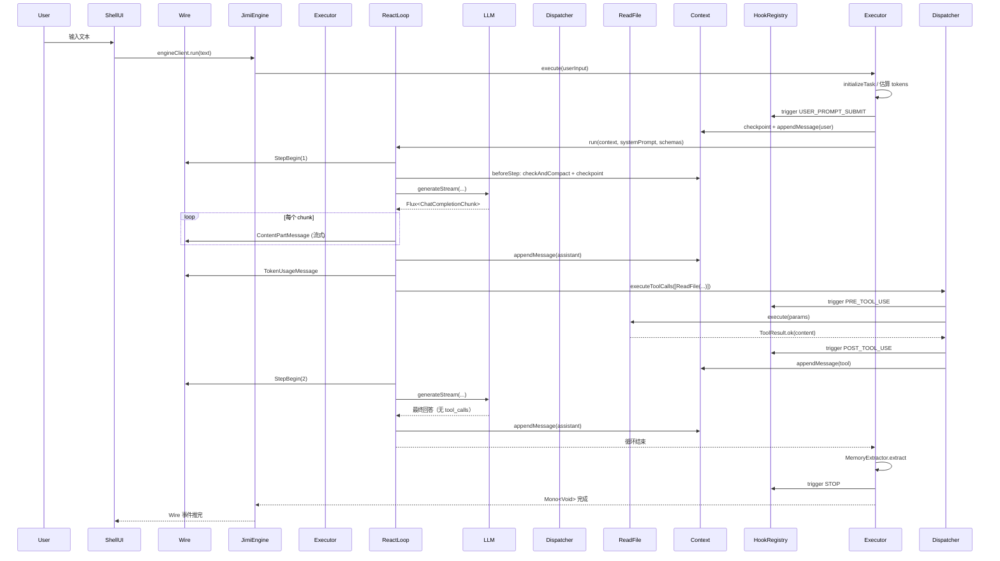

# 02 · 系统架构与核心引擎

> 理解 Jimi 内部是如何把 CLI 输入、LLM 推理、工具执行、上下文管理、Hook 触发、记忆抽取串起来的。

---

## 1. 分层架构总览

Jimi 整体划分为 6 个垂直层次 + 1 条横贯始终的 **Wire 消息总线**：

```
┌────────────────────────────────────────────────────────────┐
│  ① 交互层    ShellUI (JLine)  ←─┐                          │
│              CliApplication     │ EngineClient ↔ Wire      │
│              CommandRegistry    │                          │
├────────────────────────────────────────────────────────────┤
│  ② 门面层    JimiEngine  (实现 Engine 接口，Facade 模式)    │
├────────────────────────────────────────────────────────────┤
│  ③ 编排层    AgentExecutor  (生命周期 + Hook + Memory)      │
│              └─ ReactLoop   (ReAct 核心循环)                │
├────────────────────────────────────────────────────────────┤
│  ④ 组件层    AgentRegistry · ToolRegistry · ToolDispatcher  │
│              ContextManager · Compaction · Approval         │
├────────────────────────────────────────────────────────────┤
│  ⑤ 知识层    Skills · Graph · RAG · Memory · Hooks           │
├────────────────────────────────────────────────────────────┤
│  ⑥ LLM 层    LLM · ChatProvider (Kimi/OpenAI/Cursor/…)       │
└────────────────────────────────────────────────────────────┘
                          ⇅
                     Wire 消息总线（贯穿所有层）
```

- **单向数据流**：用户输入自上而下，执行结果（流式 token / Wire 事件）自下而上。
- **依赖倒置**：上层依赖下层的接口（`Engine` / `ChatProvider` / `Tool` / `ToolProvider`），实现由 Spring 或 Factory 装配。
- **响应式贯穿**：每一层都返回 `Mono<T>` / `Flux<T>`，不阻塞调用线程。

---

## 2. 启动与装配流程

### 2.1 Spring Boot 引导

入口类 `JimiApplication` 极简，仅做一件事：

```java
@SpringBootApplication
public class JimiApplication {
    public static void main(String[] args) {
        SpringApplication.run(JimiApplication.class, args);
    }
}
```

应用类型在 `application.yml` 中被声明为 `web-application-type: none`，即**不启用内嵌 Web 服务器**，避免多余开销。

### 2.2 CliApplication 接管生命周期

`CliApplication` 同时实现了两个接口：

| 接口 | 作用 |
|------|------|
| `CommandLineRunner` | Spring 容器启动完成后自动调用 `run(String... args)` |
| `Runnable` (`picocli.CommandLine.Command`) | Picocli 完成参数解析后调用 `run()` |

两者串起来形成如下流程：

```
Spring 启动 → CliApplication.run(args) → CommandLine.execute(args)
                                           ↓
                                     Picocli 解析参数 → this.run()
                                           ↓
                                      executeMain()
```

`executeMain()` 的关键步骤（源码位置 `io.leavesfly.jimi.CliApplication#executeMain`）：

1. `DebugLogger.enable()`（如有 `--debug`）
2. 创建或恢复 `Session`（`SessionManager.createSession` / `continueSession`）
3. 通过 `JimiFactory.createEngine()` 构建 `JimiEngine`（Builder 模式）
4. **有 `-c` 参数**：直接 `jimiEngine.run(command).block()` 并退出
5. **无 `-c`**：创建 `WireEngineClient` 包裹 Engine，启动 `ShellUI.run().block()` 进入交互循环

### 2.3 JimiFactory：核心装配器

`JimiFactory`（`@Service`）是一台"组装流水线"。它被注入了 14 个依赖 Bean（Config、ObjectMapper、AgentRegistry、ToolRegistryFactory、LLMFactory、SessionManager、Wire、Compaction、ContextManager、HookRegistry、CustomCommandRegistry、SkillRegistry、MemoryManager），然后通过 `EngineBuilder` 在**每次新建会话时**组装一个完整的 `JimiEngine`。

`doCreateEngine()` 的 10 个步骤（严格对应源码顺序）：



> 注意 ③ 到 ⑤ 的先后：**先建 LLM 和 Runtime，再加载 Agent**。因为 Agent 系统提示词需要用 `JimiRuntime.builtinArgs` 里的当前时间、工作目录、AGENTS.md、技能摘要、记忆摘要做变量替换（由 `StringSubstitutor` 完成）。

---

## 3. 核心三元组：JimiEngine / AgentExecutor / ReactLoop

这是整个系统的心脏，遵循 **Facade → Orchestrator → Kernel** 三层分离：

| 层 | 类 | 职责 | 代码行数 |
|----|----|----|----|
| **门面层** | `JimiEngine` | 对外暴露 `Engine` 接口，委托所有操作给 `AgentExecutor` | 159 |
| **编排层** | `AgentExecutor` | 任务生命周期、Hook 触发、记忆抽取、Compaction 安排 | 307 |
| **内核层** | `ReactLoop` | 纯净的 ReAct 循环：LLM 调用 ↔ 工具执行 | 189 |

### 3.1 JimiEngine（门面）

`JimiEngine.run(userInput)` 是**唯一的对外入口**。它做两件事：

1. 校验 LLM 是否已配置（未配置抛 `LLMNotSetException`）
2. 把请求委托给 `AgentExecutor.execute(userInput, skipKnowledge)`

此外，它在构造时做了两个关键绑定：

```java
// 主 Agent 把 Approval 事件转发到 Wire（子 Agent 不订阅，避免重复）
if (!executor.isSubagent()) {
    executor.getRuntime().getApproval().asFlux().subscribe(executor.getWire()::send);
}

// 启动 Wire 请求处理器，处理 Client 上行请求
this.wireRequestHandler = new WireRequestHandler(executor.getWire(), executor);
this.wireRequestHandler.start();
```

### 3.2 AgentExecutor（编排）

`AgentExecutor.execute()` 的 5 个核心阶段：

```
┌─────────────────────────────────────────────────────────────┐
│ Phase 1 · 初始化                                             │
│   - executionState.initializeTask()                         │
│   - 估算用户输入 Token 数（TokenCounter）                    │
├─────────────────────────────────────────────────────────────┤
│ Phase 2 · Hook 触发：USER_PROMPT_SUBMIT                      │
├─────────────────────────────────────────────────────────────┤
│ Phase 3 · Context 准备                                       │
│   - context.checkpoint(false)（创建恢复点）                 │
│   - context.appendMessage(userMessage)                      │
│   - context.updateTokenCount(...)                           │
│   - contextManager.matchAndInjectTopics(...)（Layer 2 记忆）│
├─────────────────────────────────────────────────────────────┤
│ Phase 4 · ReAct 循环                                         │
│   - new ToolDispatcher(toolRegistry, workDir, wire,         │
│                        toolErrorTracker, hookRegistry)      │
│   - new ReactLoop(llm, toolDispatcher, session,             │
│                   config.loopControl.maxStepsPerRun)        │
│   - 配置 4 个回调（见下）后 reactLoop.run(context,           │
│         agent.systemPrompt, toolRegistry.getToolSchemas())  │
├─────────────────────────────────────────────────────────────┤
│ Phase 5 · 生命周期回调                                       │
│   - 成功：MemoryExtractor.extract + 条件触发 Consolidator   │
│           + STOP Hook                                       │
│   - 失败：ON_ERROR Hook                                     │
└─────────────────────────────────────────────────────────────┘
```

`AgentExecutor` 自己不参与循环内部的任何流转——它只是**给 `ReactLoop` 装配 4 个回调**：

```java
reactLoop.setOnStepBegin((localStep, globalStep) -> {
    executionState.setStepsInTask(localStep);
    wire.send(new StepBegin(globalStep, isSubagent, agentName));
});

reactLoop.setBeforeStep(stepNo ->
    // 每步前检查并按需触发上下文压缩
    contextManager.checkAndCompact(context, llm, compaction)
        .then(context.checkpoint(false))
        .then());

reactLoop.setOnContentChunk(chunk -> {
    // 流式 token 通过 Wire 推给 UI
    wire.send(new ContentPartMessage(new TextPart(chunk.getContentDelta()), type));
});

reactLoop.setOnAssistantMessage((message, acc) -> {
    // 更新 token 统计并推 TokenUsageMessage
    context.updateTokenCount(...).subscribe();
    wire.send(new TokenUsageMessage(acc.getUsage()));
});
```

### 3.3 ReactLoop（内核）

`ReactLoop` 的设计原则（见源码类注释）：

- **单一职责**：仅负责 ReAct 循环核心逻辑（LLM 调用 → 工具执行 → 继续 or 终止）
- **回调机制**：通过 `onStepBegin / beforeStep / onContentChunk / onAssistantMessage` 让编排层注入附加行为
- **零附加功能**：不包含 Memory、Compaction 逻辑

其 `step()` 方法的完整流程：



**终止循环的 5 种情况**（覆盖源码所有分支）：

| 触发条件 | 来源 | 处理方式 |
|----------|------|----------|
| `session.isCancelled()` | 用户 `Ctrl+C` 或上行取消请求 | 抛 `RunCancelledException`（编排层接住后 wire.send(StepInterrupted)） |
| `globalStep > maxSteps` | `config.loop_control.max_steps_per_run`（默认 100） | 抛 `MaxStepsReachedException` |
| Assistant 消息无 `tool_calls` | LLM 输出完整回答 | 自然结束（`processToolCalls` 返回 `Mono.just(true)`） |
| `toolDispatcher.shouldTerminateLoop()` | `ToolErrorTracker` 连续相同错误达阈值 `MAX_REPEATED_ERRORS = 3` | 自然结束（打印 warn 日志） |
| LLM 调用抛错 | `generateStream` 链路异常 | `handleLLMError` 吞异常并返回 `Mono.just(true)` 自然结束（debug 级日志，避免用户看到堆栈） |

> 前两种通过异常传播到 `AgentExecutor` 的 `onErrorResume`，后三种则通过 `Mono.just(true)` 让递归的 `step()` 自然退出。

---

## 4. Context：上下文与持久化

### 4.1 Context 的职责

`Context` (`io.leavesfly.jimi.core.engine.context.Context`) 是**每个会话独占**的上下文状态容器。它持有：

- `history: List<Message>` ——消息历史（LLM 的对话记录）
- `tokenCount: int` ——当前累计 token 数
- `nextCheckpointId: int` ——下一个检查点 ID
- `activeSkills: List<SkillSpec>` ——当前已激活的技能（保留字段，渐进式披露模式下不再自动注入）
- `repository: ContextRepository` ——持久化委托

### 4.2 JSONL 持久化

`JSONLContextRepository` 把每条消息、每次 token 更新、每个检查点都作为一行 JSON 追加到 `~/.jimi/sessions/<workDirHash>/<sessionId>.jsonl`。

每行是一个独立 JSON 对象，可能的类型：

| 类型标记 | 内容 |
|----------|------|
| `message` | 一条 `Message`（用户 / assistant / tool） |
| `token_count` | 最新 token 计数 |
| `checkpoint` | 检查点 ID（用于回退） |

### 4.3 Checkpoint 机制

`context.checkpoint(addUserMessage)`：

1. 分配新的 `checkpointId`（从 0 递增）
2. `repository.saveCheckpoint(id)` 追加 checkpoint 行到 JSONL
3. 如 `addUserMessage=true`，额外追加一条系统消息 `<system>CHECKPOINT N</system>` 供调试

`context.revertTo(checkpointId)`：

1. `repository.revertToCheckpoint(id)` **轮转原文件并截断到指定 checkpoint**
2. 内存中的 `history / tokenCount / nextCheckpointId` 重置为回退后的状态

用途：
- `/reset` 命令
- **Compaction 之后**（先 revert 到 checkpoint 0，再把压缩后的消息 append 回去）

### 4.4 Compaction 触发

在 `ReactLoop.beforeStep` 回调中，`ContextManager.checkAndCompact` 会检查：

```java
if (context.getTokenCount() > llm.getMaxContextSize() - EngineConstants.RESERVED_TOKENS) {
    wire.send(new CompactionBegin());
    compaction.compact(history, llm)
        .flatMap(compacted -> context.revertTo(0)
            .then(context.appendMessage(compacted)))
        .doOnSuccess(...).doOnError(...);
}
```

`EngineConstants.RESERVED_TOKENS = 20_000`，即当**剩余上下文不足 2 万 token** 时触发压缩。默认实现 `SimpleCompaction` 的策略是保留最近 2 条用户+助手消息，其余让 LLM 总结成 1 条 assistant 消息。

---

## 5. ToolDispatcher：并行 + 串行混合调度

`ReactLoop` 拿到 LLM 返回的 `tool_calls` 列表后，并不是简单地逐个串行调用。`ToolDispatcher.executeToolCalls(toolCalls, context)` 会做**批次化调度**（源码 `io.leavesfly.jimi.core.engine.toolcall.ToolDispatcher`）：

### 5.1 批次分组

按 `Tool.isConcurrentSafe()` 把连续的工具调用切成批次：

- 读操作（`ReadFile`/`Grep`/`Glob`/`FetchURL`/`WebSearch` 等）— `isConcurrentSafe() == true`，**可并行**
- 写操作（`WriteFile`/`StrReplaceFile`/`BashTool` 等）— `isConcurrentSafe() == false`，**必须串行**

分组规则：**连续的安全工具合并为一个并行批次；遇到非并发安全工具时单独形成一个串行批次**。这样既保留了 LLM 指定的顺序语义，又在安全场景下最大化并发。

### 5.2 调度参数

```
MAX_PARALLEL_CONCURRENCY = 4   // 单个并行批次内最多同时 4 个工具并发
```

并行批次内使用 `Flux.flatMap(toolCall -> executeToolCall(toolCall, context), MAX_PARALLEL_CONCURRENCY)` 且 `subscribeOn(Schedulers.boundedElastic())`，确保 I/O 密集型工具不阻塞 Reactor 核心线程。

### 5.3 ToolErrorTracker：错误熔断

`ToolErrorTracker`（`@Component`）会跟踪最近的工具错误。当**同一工具的同样错误连续出现 `MAX_REPEATED_ERRORS = 3` 次**时，将 `shouldTerminate` 置为 `true`，`ReactLoop` 下一步检查到后终止循环——避免 LLM 卡在死循环里反复调用失败的工具。

---

## 6. Wire 消息总线

### 6.1 为什么需要 Wire

Engine 内部是**纯响应式 + 无状态 UI** 的结构，UI 和 Engine 通过 `Wire` 解耦：

- **下行（Engine → Client）**：StepBegin、ContentPartMessage、TokenUsageMessage、CompactionBegin/End、Approval 请求、StepInterrupted……
- **上行（Client → Engine）**：切换 Agent、注入系统消息、取消任务……

### 6.2 实现机制

`WireImpl` 使用两个 `Sinks.Many<?>`（Reactor 3.x 的多播 Sink）：

```java
messageSinkRef : Sinks.Many<WireMessage>   // 下行
requestSinkRef : Sinks.Many<WireRequest<?>>// 上行
```

- 下行 `send(msg)`：`Sinks.many().multicast().onBackpressureBuffer()`，支持多订阅者、带背压缓冲
- 上行 `request(req)`：Client 投递 `WireRequest`，内部带一个 `Sink<R>`，Engine 处理完回填响应

`reset()` 能原子替换两个 Sink，让同一个 Wire Bean 支持**多次 Engine 生命周期**（切换 Agent / 新会话时复用）。

### 6.3 WireRequestHandler

每个 `JimiEngine` 构造时会启动一个 `WireRequestHandler`（`wireRequestHandler.start()`），它订阅 `wire.requests()` 并根据请求类型调用 `AgentExecutor` 的相应方法。这是**把 UI 上行命令翻译成 Engine 内部行为**的桥梁。

---

## 7. 完整调用时序

以"用户输入 `读取 pom.xml 并总结核心依赖`"为例：



---

## 8. 关键扩展点总结

| 想做什么 | 需要改哪里 | 参考章节 |
|----------|------------|----------|
| 加新工具 | 实现 `Tool` + 注册 `ToolProvider` | [04 · 工具系统与 ToolRegistry](04-工具系统与ToolRegistry.md) |
| 接新模型 | 实现 `ChatProvider` + 注册 `ProviderType` | [05 · LLM 接入层与多模型支持](05-LLM接入层与多模型支持.md) |
| 改循环策略 | 继承/替换 `ReactLoop` 或调整 `loop_control` 配置 | 本篇 §3.3 |
| 改压缩算法 | 实现 `Compaction` 接口替换 `SimpleCompaction` | [10 · 记忆管理与会话机制](10-记忆管理与会话机制.md) |
| 加 Hook 事件 | 在 `AgentExecutor` 插入 `triggerHookSafely(HookType.XXX, ctx)` | [07 · Hooks 自动化系统](07-Hooks自动化系统.md) |
| 改持久化格式 | 实现 `ContextRepository` 替换 `JSONLContextRepository` | 本篇 §4.2 |
| 改并发上限 | 修改 `ToolDispatcher.MAX_PARALLEL_CONCURRENCY` 常量 | 本篇 §5.2 |
| 改错误熔断阈值 | 修改 `ToolErrorTracker.MAX_REPEATED_ERRORS` 常量 | 本篇 §5.3 |

---

**[⬅ 上一篇：01 · 项目概述与快速开始](01-项目概述与快速开始.md)** | **[回到首页](Home.md)** | **[下一篇：03 · Agent 多智能体系统 ➡](03-Agent多智能体系统.md)**
