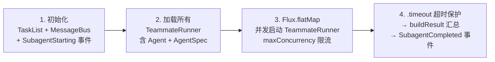

# 03 · Agent 多智能体系统

> Jimi 最核心的设计之一：**主 Agent + Subagent + Team** 三层协作架构。

---

## 1. 为什么需要多 Agent

单一 Agent 有两个天然瓶颈：

1. **上下文污染**：复杂任务（如修复编译错误）会产生大量中间步骤，把主上下文塞满
2. **角色冲突**：文档编写、代码实现、测试验证需要的系统提示词风格差别很大

Jimi 的解决方案是三层 Agent 架构：

| 层级 | 职责 | 上下文 | 通信 |
|------|------|--------|------|
| **主 Agent** (Default-Agent) | 接收用户输入、全局协调、决定何时委派 | 持续累积（带 checkpoint + compaction） | — |
| **Subagent** | 处理独立子任务（修 bug、搜资料、重构模块） | **全新且隔离**（仅看到 prompt） | 单向：只把最终文本回给主 Agent |
| **Team** | 角色协作（架构师 + 开发 + 测试 + 文档） | 每个 Teammate 独立上下文 | **横向**：通过 TeamMessageBus + SharedTaskList |

---

## 2. Agent 实体与规范

### 2.1 Agent（运行时实体）

`io.leavesfly.jimi.core.agent.Agent` 是一个**无状态、不可变的配置对象**（源码注释明确强调"缓存安全、线程安全"），仅包含 4 个字段：

| 字段 | 类型 | 说明 |
|------|------|------|
| `name` | `String` | Agent 名称，如 `Default-Agent` |
| `systemPrompt` | `String` | 已完成变量替换的系统提示词（`${JIMI_NOW}` 等占位符已被渲染） |
| `model` | `String` | 指定的模型名（可选，为空则沿用全局默认） |
| `tools` | `List<String>` | 工具名列表（注意：源码注释说"工具类的完整类名"，但实际写入的是工具 `getName()`，即简单名，如 `ReadFile`/`Grep`） |

因为没有运行时状态，同一个 `Agent` 实例可以被多次使用并在多个 Session / JimiRuntime 之间共享——真正的运行态都在 `Context`、`Session`、`ExecutionState` 中。

### 2.2 AgentSpec（YAML 规范）

对应 `agent.yaml` 的结构（`io.leavesfly.jimi.core.agent.AgentSpec`）：

```yaml
name: Default-Agent
description: 通用软件开发助手
system_prompt: system_prompt.md         # 相对路径
system_prompt_args: { }                 # 可选：模板变量
model: qwen3.5-plus                     # 可选：覆盖全局默认模型

tools:                                  # 工具白名单
  - Glob
  - Grep
  - ReadFile
  - BashTool
  - SubAgentTool
  - TeamAgentTool
  # ...

exclude_tools: [ ]                      # 工具黑名单

subagents:                              # Subagent 清单
  Code-Agent:
    path: sub/code/agent.yaml
    description: 代码实现、重构、优化和调试

team:                                   # Team 配置（可选）
  name: dev-team
  max_concurrency: 3
  timeout_seconds: 1800
  strategy: free_claim
  teammates: [ ... ]
```

**工具过滤规则**（源码 `AgentRegistry.loadAgent`）：

1. 起点：直接取 `spec.getTools()`（即 YAML 里 `tools` 原始列表）
2. 若 `exclude_tools` 非空，过滤掉其中出现的工具名
3. 没有去重逻辑——重复声明同名工具会被保留（但 `ToolRegistry.register` 内部按名称覆盖注册，实际只生效一次）

> 注意：`tools` 列表里的名称必须和工具的 `getName()` 返回值完全一致（内置工具如 `ReadFile`/`Grep`/`BashTool`，MCP 工具会自动加 `mcp__<server>__<tool>` 前缀）。

### 2.3 目录结构

Jimi 内置 Agent 位于 `src/main/resources/agents/`：

```
agents/
├── default/
│   ├── agent.yaml              # 主 Agent 配置
│   └── system_prompt.md        # 系统提示词模板
├── sub/                        # 5 个领域 Subagent
│   ├── architect/              # 架构设计
│   ├── code/                   # 代码实现
│   ├── quality/                # 质量保障
│   ├── devops/                 # 构建部署
│   └── doc/                    # 文档调研
└── team/                       # 4 个团队角色
    ├── architect/
    ├── coder/
    ├── tester/
    └── doc-writer/
```

---

## 3. AgentSpecLoader：两种加载模式

`AgentSpecLoader`（`@Service`）在 `@PostConstruct` 阶段**全量预加载并缓存**所有 Agent 规范。支持两种优先级模式：

| 模式 | 触发条件 | 扫描路径 |
|------|----------|----------|
| **文件系统** | 启动时能解析出本地 `agents/` 目录 | 递归查找 `agentsRootDir/**/agent.yaml` |
| **classpath** | 上面失败（JAR 运行场景） | `classpath:agents/**/agent.yaml`（由 Spring `PathMatchingResourcePatternResolver` 扫描） |

**路径表示约定**：

- 文件系统路径 → `Path` 原值
- classpath 路径 → 以 `classpath:` 前缀拼接（如 `classpath:agents/default/agent.yaml`），内部用 `Paths.get(...)` 包装但仅作键使用，真正读取时会剥离前缀并用 `ClassLoader.getResourceAsStream()` 打开

这样可以让**外部工程覆盖内置 Agent**：用户在工作目录的 `agents/` 下放同名文件，即可覆盖 JAR 内置的同名 Agent。

---

## 4. Subagent 委派机制

### 4.1 SubAgentTool 概览

`io.leavesfly.jimi.tool.core.SubAgentTool` 是主 Agent 委派子任务的**唯一入口**。其特点：

- `@Scope(PROTOTYPE)`：每次构造都是新实例，避免状态污染
- **懒加载**：通过 `cachedLoadMono` + `synchronized` 双重检查锁 + `Mono.cache()` 实现线程安全的一次性加载——首次 `execute()` 被调用时才真正加载所有 subagents，后续调用直接复用缓存
- **动态工具描述**：`getDescription()` 返回由 `loadDescription(agentSpec)` 动态拼接的字符串，**把当前 Agent 的 `subagents` 清单完整列进工具说明**，LLM 看到的是"可用的子代理：`Code-Agent`: ...、`Doc-Agent`: ..."的完整菜单
- **简短响应处理**：见 §4.3 的 3 分支决策

调用参数（`SubAgentTool.Params`）：

| 字段 | 说明 |
|------|------|
| `description` | 任务的简短描述，用于日志和展示 |
| `subagent_name` | 必须是当前 Agent 的 `subagents` map 中声明过的 key（主 Agent 也可嵌套 subagents，此处"当前 Agent"指调用方） |
| `prompt` | 发给子 Agent 的完整提示词（**必须自包含**——子 Agent 看不到主 Agent 的历史） |

### 4.2 Subagent 的上下文隔离

`SubAgentTool.runSubagent()` 的 6 步执行流程：

```
1. wire.send(new SubagentStarting(agentName, prompt))
2. 在系统临时目录创建临时 JSONL 历史文件 subHistoryFile
3. 创建全新的 Context(subHistoryFile, objectMapper)
   ↑ 不调用 restore()，保证零历史污染
4. 为子 Agent 创建独立的 ToolRegistry（基于子 AgentSpec 的 tools 列表）
5. 用 Builder 模式创建 AgentExecutor，isSubagent=true
   → 用子 agent + 同一 jimiRuntime + 全新 context + 同一 wire + 子 toolRegistry
   → JimiEngine.create(executor) 得到子 engine
6. subEngine.run(prompt)
   .then(extractFinalResponse(...))       // 从 history 末尾找最后一条 assistant 文本
   .doFinally(_ -> cleanupTempHistoryFile(subHistoryFile))
```

**关键约束**：
- 子 Agent 与主 Agent **共享 Wire 和 Runtime**（共享 Session、Approval、LLM、builtinArgs）
- 子 Agent **独享 Context 和 ToolRegistry**（上下文、工具集完全隔离）
- 子 Agent 历史**不持久化**到 `~/.jimi/sessions/`，任务结束即删除临时文件

### 4.3 extractFinalResponse 的决策分支

子 Agent 运行结束后，`extractFinalResponse()` 使用 `findLastAssistantTextResponse()` 从 `history` 末尾向前查找**最后一条包含文本内容的 ASSISTANT 消息**，然后根据 4 个分支决策返回：

| 分支 | 条件 | 行为 |
|------|------|------|
| ① **未找到文本 + 无 ASSISTANT 消息** | history 里完全没有 ASSISTANT 消息 | 返回 `ToolResult.error("The subagent seemed not to run properly...")` |
| ② **未找到文本 + 有 ASSISTANT 消息** | 有 ASSISTANT 消息但全是纯工具调用（无文本 content） | 返回成功 `"Subagent completed the task via tool calls."`（**不触发续问**，因为任务已通过工具完成） |
| ③ **文本过短 + 最后一条 ASSISTANT 带 tool_calls** | 长度 < `minResponseLength` 但 `hasToolCallsInLastAssistantMessage()` 为真 | **不触发续问**，直接把短文本作为结果返回（短文本是正常的中间状态） |
| ④ **文本过短 + 最后一条 ASSISTANT 无 tool_calls** | 长度 < `minResponseLength`（默认 10 字符）且无 tool_calls | 调用 `requestContinuation()` 发送 `continuePrompt` 续问**一次**；续问后再次提取，若仍无有效文本则回退到原短文本 |
| ⑤ **文本足够长** | 长度 ≥ `minResponseLength` | 直接返回 `ToolResult.ok(response, ...)` |

这个多分支机制保证主 Agent 拿到的是**可读的总结**或**明确的成功信号**，既不会因空响应误判失败，也不会对合法的工具调用型任务做无意义的追问。

---

## 5. Team 团队协作机制

### 5.1 Team vs Subagent 的区别

| 维度 | Subagent | Team |
|------|----------|------|
| **触发入口** | `SubAgentTool` | `TeamAgentTool` |
| **任务粒度** | 单次独立子任务 | 多任务协同（含依赖拓扑） |
| **横向通信** | ❌ 子 Agent 之间互不可见 | ✅ 通过 `TeamMessageBus` 广播进度 |
| **任务编排** | ❌ 主 Agent 在每次 SubAgentTool 调用里传完整 prompt | ✅ `SharedTaskList` 统一维护 `taskId / priority / dependencies / status` |
| **并发模型** | 主 Agent 的 LLM **可以并发发起多个 SubAgentTool 调用**（由 `ToolDispatcher` 按 `isConcurrentSafe()` 并发执行），但**子 Agent 之间彼此隔离** | Teammate 池按 `max_concurrency` 并发认领任务，依赖未满足的任务会阻塞等待 |
| **调度策略** | 无——每次由主 Agent 显式指定 `subagent_name` | `FREE_CLAIM` / `ROUND_ROBIN` / `SPECIALTY_MATCH` 三选一 |

> 简言之：**Subagent 适合"扔一个自包含任务，拿结果"；Team 适合"多角色按依赖顺序协作完成一组相互关联的任务"**。

### 5.2 核心组件

```
┌──────────────────────────────────────────────────────────────┐
│ TeamManager (@Scope PROTOTYPE)                               │
│  ├─ SharedTaskList   — 线程安全的任务状态共享池                │
│  │    (ConcurrentHashMap<taskId, TeamTask>)                  │
│  │    └─ TeamTask                                            │
│  │        字段: taskId/description/priority/dependencies/    │
│  │              status/claimedBy/result/claimedAt/completedAt│
│  │        状态枚举: PENDING → CLAIMED → IN_PROGRESS          │
│  │                         → COMPLETED / FAILED / CANCELLED  │
│  │        tryClaim(): synchronized CAS，status≠PENDING 则拒绝 │
│  │    claimTask(): 按 priority 升序 + 依赖已满足 顺序认领      │
│  ├─ TeamMessageBus   — Teammate 间消息广播（任务完成时推送）   │
│  └─ Map<teammateId, TeammateRunner>                          │
│       └─ TeammateRunner (@Scope PROTOTYPE)                   │
│          - 独立 Context + 独立 ToolRegistry                   │
│          - 共享 Wire + Runtime + SharedTaskList + MessageBus │
└──────────────────────────────────────────────────────────────┘
```

**关键设计**：
- `TeamTask.tryClaim()` 使用 `synchronized` 保证"检查 status → 置为 CLAIMED"的原子性，防止多个 Teammate 抢同一任务
- `SharedTaskList.getClaimableTasks()` 只返回 `status == PENDING` **且**所有 `dependencies` 均已 `COMPLETED` 的任务
- `TeamTask.isTerminal()` 返回 `status ∈ {COMPLETED, FAILED, CANCELLED}`，用于判断循环是否可终止

### 5.3 调度策略 TeamStrategy

源码在 `io.leavesfly.jimi.team.TeamStrategy`：

| 策略 | 含义 |
|------|------|
| `FREE_CLAIM` | **默认**。Teammate 自主从 SharedTaskList 认领未分配的任务（适合任务之间无强绑定） |
| `ROUND_ROBIN` | 轮询分配——按 Teammate 顺序循环分派 |
| `SPECIALTY_MATCH` | 按 `TeammateSpec.specialties`（字符串数组）与任务描述做语义匹配，智能分配 |

### 5.4 执行生命周期

`TeamManager.executeTeam(teamSpec, tasks)` 的 4 阶段：



**单个 `TeammateRunner.loop(idleCount)` 的完整逻辑**（见源码 `TeammateRunner.java`）：

```
1. 会话已取消？        → 退出
2. taskList 全部完成？ → 退出
3. 尝试 claimTask(teammateId)
   ├─ 成功：
   │     a. task.markInProgress()
   │     b. 为该 Teammate 创建独立 Context + ToolRegistry + AgentExecutor (isSubagent=true)
   │     c. subEngine.run(buildTaskPrompt(task))
   │     d. extractFinalResponse(subContext)
   │     e. task.markCompleted(response)（失败则 markFailed）
   │     f. messageBus.broadcast(teammateId, "Task [xxx] completed: ...")
   │     g. 清理临时 JSONL 历史文件
   │     h. loop(idleCount=0) 继续下一轮
   └─ 失败（无可认领任务）：
         - 若 !taskList.hasPendingWork()           → 退出（已无未完结任务）
         - 若 idleCount >= MAX_IDLE_RETRIES (20)   → 退出（空转上限）
         - 否则：Mono.delay(IDLE_WAIT=500ms) → loop(idleCount+1)
```

这个循环的关键常量：
- `MAX_IDLE_RETRIES = 20`——连续 20 次都认领不到任务（上限 20 × 500ms = 10s）就退出，避免死循环
- `IDLE_WAIT = Duration.ofMillis(500)`——空转间隔，用于等待依赖中的任务完成

每个 Teammate 执行任务时创建的 `AgentExecutor` 都带 `isSubagent=true`，因此**不会重复触发 SESSION_START / STOP 等 Hook**，也不会把历史持久化到 `~/.jimi/sessions/`（走临时文件路径）。

### 5.5 结果汇总 TeamResult

`buildResult()` 遍历 `taskList.getAllTasks()` 生成每个任务的 `TaskResult`：

```
{
  teamId, success, startTime, endTime,
  taskResults: [
    { taskId, description, executedBy, success, result }, ...
  ],
  errors: [ "Task X failed: ...", "Task Y not completed: ..." ]
}
```

这些会通过 `SubagentCompleted` Wire 事件推给前端。

---

## 6. Agent 切换（Hook 预留，运行时切换未实装）

源码中 `HookType` 定义了两个 Agent 切换相关事件：

```java
PRE_AGENT_SWITCH,   // Agent 切换前 — 保存状态、清理资源
POST_AGENT_SWITCH,  // Agent 切换后 — 加载配置、初始化环境
```

同时 `HookContext` 提供了 `agentName` 和 `previousAgentName` 字段供 Hook 消费。

**但是**：截至当前代码版本，`AgentExecutor` 类中**并没有对外暴露 `switchAgent()` 方法**，工程里也没有触发 `PRE_AGENT_SWITCH`/`POST_AGENT_SWITCH` 的实际调用点。也就是说：

- 这两个 Hook 类型属于**预留扩展点**，Hook 框架已具备响应能力
- 但运行时动态切换主 Agent 的**业务流程尚未实装**
- 想换主 Agent 目前的做法是：重启进程并通过 `-a / --agent-file` 指定新的 Agent 配置文件

对子 Agent 来说，切换是通过 `SubAgentTool` 的 `subagent_name` 参数在每次调用时选择的——这不是"切换"，而是**委派**。

---

## 7. 系统提示词的模板渲染

`AgentRegistry.loadAgent()` 加载 Agent 时会调用 `renderSystemPrompt()`（源码在 `AgentRegistry.java`）：

1. 读取 `AgentSpec.systemPromptPath` 指向的模板文件（支持 `classpath:` 前缀或文件系统路径）
2. 构造 `substitutionMap`，**先塞入 6 个内置变量，再 `putAll(spec.systemPromptArgs)`**——因此**自定义参数会覆盖内置同名参数**
3. 用 Apache Commons Text 的 `StringSubstitutor` 替换 `${VAR}` 占位符

**内置变量**（`BuiltinSystemPromptArgs` 共 6 个字段）：

| 占位符 | 来源 | 内容 |
|--------|------|------|
| `${JIMI_NOW}` | `ZonedDateTime.now()` 的 ISO 8601 格式 | 当前日期时间 |
| `${JIMI_WORK_DIR}` | `session.getWorkDir().toAbsolutePath()` | 工作目录绝对路径 |
| `${JIMI_WORK_DIR_LS}` | 对工作目录做非递归列目录 | 工作目录一级文件/子目录列表 |
| `${JIMI_AGENTS_MD}` | `SessionManager.loadAgentsMd(workDir)`（带缓存） | 工作目录下的 `AGENTS.md` 项目说明 |
| `${JIMI_SKILLS_SUMMARY}` | `SkillRegistry.generateSkillsSummary()` | 可用技能摘要（渐进式披露，用于引导 LLM 按需调 `SkillsTool`） |
| `${JIMI_MEMORY_SUMMARY}` | `MemoryManager` 生成 | 长期记忆摘要（来自 `MEMORY.md`） |

**注意变量命名规则**：所有内置变量都是大写+下划线，和 Java 字段名（camelCase，如 `jimiNow`）对应关系一致。写模板时必须用 `${JIMI_NOW}` 而不是 `${jimiNow}` 或 `${now}`。

渲染完成的字符串就是最终的 `Agent.systemPrompt`，在 `ReactLoop` 每次发起 `LLM.generateStream()` 时作为第 0 条 SYSTEM 消息送出。

---

## 8. 实战：如何新增一个 Subagent

假设要加一个 `Security-Agent` 专门做安全审计。

**步骤 1 · 创建 Agent 目录**

```
agents/sub/security/
├── agent.yaml
└── system_prompt.md
```

**步骤 2 · 配置 `agent.yaml`**

```yaml
name: Security-Agent
description: 代码安全审计专家
system_prompt: system_prompt.md
# model 可不写，继承主 Agent 或全局默认
tools:
  - Grep
  - ReadFile
  - BashTool
  - FetchURL
```

**步骤 3 · 在主 Agent 的 `subagents` 中声明**

编辑 `agents/default/agent.yaml`：

```yaml
subagents:
  # ... 原有 5 个 ...
  Security-Agent:
    path: sub/security/agent.yaml
    description: 代码安全审计、漏洞扫描、依赖风险评估
```

**步骤 4 · 重启**

重启后 `AgentSpecLoader.@PostConstruct` 会自动扫描到新 Agent。关键效果：

- 主 Agent 首次调用 `SubAgentTool` 时，`ensureSubagentsLoaded()` 会触发加载 `Security-Agent`
- `SubAgentTool.getDescription()` 返回的工具描述中，会**动态追加** `Security-Agent: 代码安全审计、漏洞扫描、依赖风险评估` 到"可用的子代理"列表
- LLM 通过这份动态工具描述得知新增了 `Security-Agent`，即可传入 `subagent_name: "Security-Agent"` 完成委派

> 说明：`SubAgentTool.Params` 的 JSON Schema 本身（3 个字段 `description/subagent_name/prompt`）不会变；变的是**工具描述文本**中枚举出的可选 subagent 名单。

---

## 9. 关键文件速查

| 文件 | 作用 |
|------|------|
| `core/agent/Agent.java` | Agent 运行时实体 |
| `core/agent/AgentSpec.java` | Agent YAML 规范 |
| `core/agent/SubagentSpec.java` | Subagent 声明 |
| `core/agent/AgentSpecLoader.java` | YAML 加载 + 缓存 + classpath/文件系统 |
| `core/agent/AgentRegistry.java` | 加载 Agent 实例（含系统提示词渲染） |
| `tool/core/SubAgentTool.java` | Subagent 委派工具 |
| `tool/core/TeamAgentTool.java` | Team 启动工具 |
| `team/TeamSpec.java` · `TeamStrategy.java` · `TeammateSpec.java` | Team 配置 |
| `team/TeamManager.java` | Team 调度核心 |
| `team/TeammateRunner.java` | 单个 Teammate 的执行循环 |
| `team/SharedTaskList.java` | 共享任务列表 |
| `team/TeamMessageBus.java` | Teammate 间通信总线 |

---

**[⬅ 上一篇：02 · 系统架构与核心引擎](02-系统架构与核心引擎.md)** | **[回到首页](Home.md)** | **[下一篇：04 · 工具系统与 ToolRegistry ➡](04-工具系统与ToolRegistry.md)**
