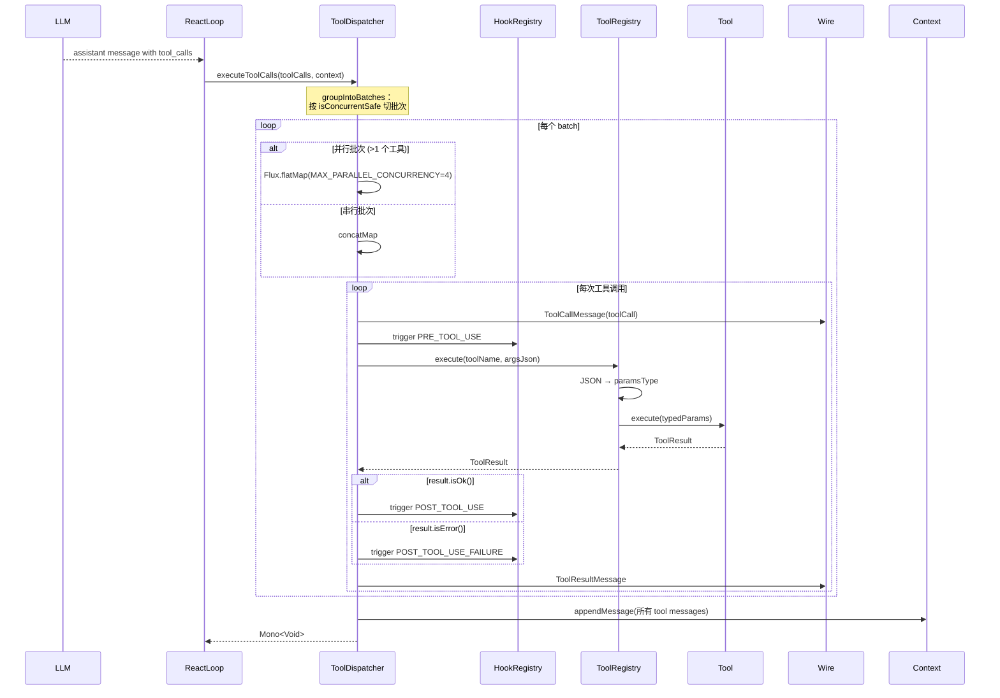

# 04 · 工具系统与 ToolRegistry

> 工具是 LLM 与真实世界交互的唯一通道。Jimi 用 `Tool` + `ToolProvider` + `ToolRegistry` 三件套实现了一个**可扩展、类型安全、并发友好**的工具体系。

---

## 1. 工具体系全景

Jimi 的工具层由 5 个核心抽象构成：

```
         ┌──────────────────────────────────────────────┐
         │  Tool<P>            (接口：工具契约)          │
         │   ├─ AbstractTool<P> (通用基类)              │
         │   └─ SyncTool<P>    (同步工具基类)           │
         └──────────────────────────────────────────────┘
                              ↑ 实现
         ┌──────────────────────────────────────────────┐
         │  具体工具 (ReadFile/Grep/BashTool/MCPTool/…)  │
         └──────────────────────────────────────────────┘
                              ↑ 被创建
         ┌──────────────────────────────────────────────┐
         │  ToolProvider        (SPI：工具提供者)        │
         │   按 getOrder() 顺序加载                      │
         └──────────────────────────────────────────────┘
                              ↑ 注册
         ┌──────────────────────────────────────────────┐
         │  ToolRegistry        (每个 Engine 独立实例)   │
         │   - register / getTool / execute             │
         │   - getToolSchemas（供 LLM 使用）             │
         └──────────────────────────────────────────────┘
                              ↑ 组装
         ┌──────────────────────────────────────────────┐
         │  ToolRegistryFactory (@Service)              │
         │   1. createStandardRegistry(注册 11 个内置工具)│
         │   2. applyToolProviders(遍历 SPI，追加工具)    │
         └──────────────────────────────────────────────┘
                              ↑ 调度
         ┌──────────────────────────────────────────────┐
         │  ToolDispatcher (批次化并发调度；见 02 篇 §5)  │
         └──────────────────────────────────────────────┘
```

---

## 2. Tool 接口：工具契约

`io.leavesfly.jimi.tool.Tool<P>` 是所有工具的祖先接口。`P` 是工具参数的 POJO 类型（必须是 Jackson 可反序列化的 JavaBean）。

| 方法 | 必要性 | 说明 |
|------|--------|------|
| `String getName()` | **必须实现** | 工具名——作为 `ToolRegistry` 的唯一键，必须和 Agent YAML 里 `tools:` 下的字符串一致 |
| `String getDescription()` | **必须实现** | 工具描述——会进入 JSON Schema 的 `function.description`，LLM 据此判断何时调用 |
| `Class<P> getParamsType()` | **必须实现** | 参数的反射类型——供 `ToolRegistry` 反序列化 + 反射生成 JSON Schema |
| `Mono<ToolResult> execute(P params)` | **必须实现** | 真正的执行逻辑，返回响应式 `Mono<ToolResult>` |
| `boolean validateParams(P params)` | 默认 `true` | 参数校验钩子（当前未被调度器主动调用，可由工具内部自用） |
| `boolean isConcurrentSafe()` | **默认 `true`** | 是否并发安全——决定 `ToolDispatcher` 能否把它放进并行批次 |
| `JsonNode getCustomParametersSchema()` | 默认 `null` | 返回非 null 时，`ToolRegistry` 跳过反射、直接使用这份 schema（MCP 工具用这招） |

### 2.1 AbstractTool：通用基类

大多数工具只需继承 `AbstractTool<P>`，在构造函数里传入 `name / description / paramsType` 三元组即可：

```java
public class MyTool extends AbstractTool<MyTool.Params> {
    public MyTool() {
        super("MyTool", "工具描述", Params.class);
    }
    @Override public Mono<ToolResult> execute(Params p) { ... }
}
```

### 2.2 SyncTool：同步工具便捷基类

I/O 或纯 CPU 类的同步工具可以继承 `SyncTool<P>`（它继承自 `AbstractTool<P>`），只实现 `executeSync(P)`——框架会自动包装成 `Mono.fromCallable(...).subscribeOn(Schedulers.boundedElastic())`：

```java
public final Mono<ToolResult> execute(P params) {
    return Mono.fromCallable(() -> executeSync(params))
               .subscribeOn(Schedulers.boundedElastic());
}
```

这样**工具开发者不需要理解 Reactor**，也不会阻塞主事件循环。`ReadFile` / `Grep` / `Glob` / `FetchURL` 等都使用 `SyncTool`。

### 2.3 isConcurrentSafe 的影响

`ToolDispatcher` 会读取这个标志做批次分组：

| 工具类别 | `isConcurrentSafe()` | 示例 |
|---------|---------------------|------|
| 纯读取 | `true`（默认） | `ReadFile` / `Grep` / `Glob` / `FetchURL` / `WebSearch` / `CodeLocateTool` 等 |
| 写入/执行 | `false`（显式 override） | `WriteFile` / `StrReplaceFile` / `BashTool` 等 |

---

## 3. ToolResult：统一返回结构

`io.leavesfly.jimi.tool.ToolResult` 封装工具执行结果：

| 字段 | 说明 |
|------|------|
| `type: ResultType` | `OK` / `ERROR` / `REJECTED` 三选一 |
| `output: String` | 详细输出内容（会拼进 tool message 返回给 LLM） |
| `message: String` | 简短结果描述 |
| `brief: String` | UI 展示用的一行摘要（可选） |

### 静态工厂方法

```java
ToolResult.ok(output, message)                  // 成功
ToolResult.ok(output, message, brief)           // 成功 + UI 摘要
ToolResult.error(message, brief)                // 错误（output 空）
ToolResult.error(output, message, brief)        // 错误 + 输出内容
ToolResult.rejected()                           // 被用户 Approval 拒绝
```

`rejected()` 返回的固定 message 是"工具调用被用户拒绝。请遵循用户的新指示。"——这段文字会回传给 LLM，让它停下当前动作。

---

## 4. ToolRegistry：每个 Engine 一份的注册表

`io.leavesfly.jimi.tool.ToolRegistry` **不是 Spring Bean**（见源码类注释）——每个 `JimiEngine` 实例都有自己的独立注册表，原因是不同 Engine 可能有不同的 Agent 工具白名单、运行时参数（工作目录、Approval、Session）。

### 4.1 核心 API

| 方法 | 作用 |
|------|------|
| `register(Tool<?>)` | 按 `tool.getName()` 作为 key 存入 `HashMap`——**同名覆盖** |
| `registerAll(Collection)` | 批量注册 |
| `getTool(String name)` | 返回 `Optional<Tool<?>>` |
| `hasTool(String name)` | 存在性检查 |
| `getToolNames() / getAllTools()` | 枚举所有已注册工具 |
| `execute(toolName, argumentsJson)` | JSON 反序列化 + 类型安全调用（见 §4.2） |
| `getToolSchemas(List<String> includeTools)` | 生成 LLM 所需的 JSON Schema 列表（见 §4.3） |

### 4.2 execute：JSON → 参数对象 → 工具执行

`ToolRegistry.execute(toolName, arguments)` 的完整流程：

```
1. getTool(toolName) → 找不到返回 ToolResult.error("Tool not found")
2. objectMapper.readValue(arguments, tool.getParamsType())
      ↓ 如抛 JsonProcessingException
      → 返回 ToolResult.error("Invalid JSON arguments...")
3. executeToolUnchecked(tool, params)
      ↓ 通过 @SuppressWarnings + 运行时 ClassCastException 防护
      → 调用 typedTool.execute(typedParams)
4. 如有其他 Exception → 返回 ToolResult.error("Failed to execute tool...")
```

**注意**：JSON 解析失败、类型不匹配都不会让整个 ReAct 循环崩溃，而是返回一条 `ERROR` 类型的 `ToolResult`——LLM 下一步会看到错误信息并尝试修正参数。

### 4.3 getToolSchemas：为 LLM 生成工具 schema

LLM 的 function-calling 需要一份 OpenAI 兼容格式的 JSON Schema：

```json
{
  "type": "function",
  "function": {
    "name": "<tool name>",
    "description": "<tool description>",
    "parameters": { ...JSON Schema for P... }
  }
}
```

生成策略（见 `ToolRegistry.generateToolSchema`）：

1. 先调 `tool.getCustomParametersSchema()`——若非 null 直接用（MCP 工具走这条路，因为它的参数类型是 `Map` 无法反射）
2. 否则调 `generateParametersSchemaByReflection(paramsType)`——**反射 POJO 字段**按如下规则：
   - 字段名优先使用 `@JsonProperty("name")` 指定的 name；否则用 Java 字段名
   - 描述优先取 `@JsonPropertyDescription("...")` 注解
   - 类型映射：`String`→`string`，`int/Integer/long/Long`→`integer`，`boolean/Boolean`→`boolean`，`double/Double/float/Float`→`number`，`List<T>`→`array`（解析泛型参数递归），`enum`→带 `enum` 数组的 `string`，其他复杂类 → 递归 `object`
   - **没有 `@Builder.Default` 注解的字段**自动进入 `required` 数组（这是一个简化规则，开发者写可选字段时务必加 `@Builder.Default`）

### 4.4 反射 schema 的注意事项

| 场景 | 建议做法 |
|------|----------|
| 参数是 `Map<String, Object>` | 覆写 `getCustomParametersSchema()` 返回手写 schema |
| 字段是可选的 | 加 `@Builder.Default private T field = defaultValue;` |
| 字段名和 JSON 字段名不一致 | 加 `@JsonProperty("json_name")` |
| 字段需要详细说明 | 加 `@JsonPropertyDescription("供 LLM 阅读的说明")` |

---

## 5. ToolProvider：SPI 扩展点

`io.leavesfly.jimi.tool.ToolProvider` 是**工具发现的 SPI 接口**。所有实现 `ToolProvider` 并标注 `@Component` 的类都会被 Spring 自动收集（通过 `List<ToolProvider>` 注入 `ToolRegistryFactory`），按 `getOrder()` 升序逐个应用。

```java
public interface ToolProvider {
    boolean supports(AgentSpec agentSpec, JimiRuntime jimiRuntime);     // 是否激活
    List<Tool<?>> createTools(AgentSpec agentSpec, JimiRuntime jimiRuntime);  // 创建工具
    default int getOrder() { return 100; }                              // 加载顺序
    default String getName() { return this.getClass().getSimpleName(); }
}
```

### 5.1 内置的 6 个 Provider

按 `getOrder()` 升序：

| Order | Provider | 激活条件 | 提供的工具 |
|-------|----------|----------|-----------|
| **30** | `InteractionToolProvider` | 默认启用（除非 `exclude_tools: [ask_human]`） | `AskHuman`（注意：默认 Agent YAML 里以 `AskHuman` 命名声明，provider 里检测 `ask_human` 字符串） |
| **50** | `TaskToolProvider` | `agentSpec.subagents` 非空 | `SubAgentTool`（@Prototype，每次新建并注入 runtime params） |
| **55** | `TeamToolProvider` | `agentSpec.team.teammates` 非空 | `TeamAgentTool` |
| **60** | `MCPToolProvider` | 外部调用了 `setMcpConfigFiles(...)` 且列表非空 | 由 `MCPToolLoader.loadFromFile()` 从 MCP 服务器加载的全部 MCP 工具 |
| **100** | `CodeToolProvider` | `graphManager != null && graphManager.isEnabled()` | `CodeLocateTool`（需 `HybridSearch` 启用）、`ImpactAnalysisTool`、`CallGraphTool` |
| **200** | `MetaToolProvider` | `metaToolConfig.enabled == true` | `MetaTool`——**执行时会注入 `ToolRegistry` 引用**，使其能在 JShell 里反向调用其他工具 |

> ⚠️ **`exclude_tools` 的命名一致性陷阱**：`InteractionToolProvider.supports()` 里检测的是字符串 `"ask_human"`（snake_case），而 `AskHuman` 类构造器传入的 `getName()` 是 `"AskHuman"`（PascalCase）。也就是说，在 Agent YAML 里写 `exclude_tools: [ask_human]` 确实会命中 `InteractionToolProvider` 的过滤分支，使 `AskHuman` 不被加载——这是该 provider 当前唯一识别的禁用字符串。其他工具的 `exclude_tools` 匹配逻辑参见各自 provider 实现。

### 5.2 Provider 加载顺序的意义

加载顺序决定**同名工具被谁的实现覆盖**（`ToolRegistry.register()` 是同名覆盖语义）。`MetaToolProvider` 放最后（order=200）是因为它需要引用已经填满的 `ToolRegistry`（通过 `setToolRegistry()`），以便 `MetaTool` 运行时能反向调用。

---

## 6. ToolRegistryFactory：组装流水线

`io.leavesfly.jimi.tool.ToolRegistryFactory`（`@Service`）是工具注册表的唯一构造者。它被 `JimiFactory` 在每次新建 Engine 时调用：

```java
ToolRegistry registry = toolRegistryFactory.create(
    builtinArgs,   // 含 workDir/agentsMd/skillsSummary/memorySummary
    approval,      // Approval 服务（供写类工具确认）
    agentSpec,     // Agent 规范（供 Provider 判断 supports）
    jimiRuntime,   // 运行时（含 session/llm/config）
    mcpConfigFiles // MCP 配置文件列表（可为 null）
);
```

### 6.1 两阶段装配

```
Phase A · createStandardRegistry(builtinArgs, approval, session)
  ├─ new ToolRegistry(objectMapper)
  ├─ 获取 SandboxValidator Bean（可选）
  └─ 遍历 BUILTIN_TOOL_TYPES，从 Spring 容器拿原型 Bean，按类型注入依赖：
      ReadFile       ← setBuiltinArgs
      WriteFile      ← setBuiltinArgs + setApproval + setSandboxValidator
      StrReplaceFile ← setBuiltinArgs + setApproval + setSandboxValidator
      Glob           ← setBuiltinArgs
      Grep           ← setBuiltinArgs
      BashTool       ← setApproval + setSandboxValidator
      FetchURL       (无额外注入)
      WebSearch      (无额外注入)
      SetTodoList    ← setSession（若非空）
      SkillsTool     (由 Spring 自动装配)
      MemoryTool     ← setMemoryManager + setWorkDirPath + setSessionsDir

Phase B · applyToolProviders(registry, agentSpec, jimiRuntime, mcpConfigFiles)
  ├─ 先给 MCPToolProvider 调 setMcpConfigFiles(...)
  ├─ 再给 MetaToolProvider 调 setToolRegistry(registry)  ← 关键时序
  └─ toolProviders.stream()
        .sorted(Comparator.comparingInt(ToolProvider::getOrder))
        .filter(p -> p.supports(agentSpec, jimiRuntime))
        .forEach(p -> registry.register(p.createTools(...)))
```

### 6.2 BUILTIN_TOOL_TYPES 清单（11 个）

源码硬编码的内置工具列表（`ToolRegistryFactory.BUILTIN_TOOL_TYPES`）：

```java
ReadFile, WriteFile, StrReplaceFile, Glob, Grep,       // 文件操作 × 5
BashTool,                                              // Shell 执行 × 1
FetchURL, WebSearch,                                   // Web × 2
SetTodoList,                                           // Todo 管理 × 1
SkillsTool, MemoryTool                                 // 知识/记忆 × 2
```

**新增内置工具**只需在此列表追加一个 `Tool<?>` 子类的 `Class` 字面量，并在 `createAndInitializeTool()` 里添加对应的 `instanceof` 分支做依赖注入（见 §9 扩展指南）。

---

## 7. 内置工具逐一速查

按功能域分组（**✓** = 并发安全）：

### 7.1 文件操作（`tool/core/file/`）

| 工具 | 并发安全 | 说明 |
|------|:----:|------|
| `ReadFile` | ✓ | 按行范围读取文本文件；支持 `should_read_entire_file` |
| `Glob` | ✓ | 使用 glob 模式匹配文件路径 |
| `Grep` | ✓ | 正则搜索文件内容，参数包含 `pattern` / `path` / `glob`（用于过滤文件名的 glob 模式，如 `*.java`）/ `outputMode`（`content`/`files_with_matches`/`count_matches`）/ `lineNumber` / `ignoreCase` / `headLimit`；最大文件 10MB，自动跳过二进制 |
| `WriteFile` | ✗ | 写入文件（`overwrite` 或 `append` 模式），所有写入操作通过 `Approval` 请求确认；受 `SandboxValidator` 路径越狱检测保护 |
| `StrReplaceFile` | ✗ | 基于"`old_str` → `new_str`"的精确字符串替换；`new_str` 有 `@Builder.Default = ""`，传空字符串即等同于删除片段；工具描述建议先用 `ReadFile` 确认文件内容（非硬性约束），替换失败时工具会返回最相似片段帮助修正 |

### 7.2 Shell 执行（`tool/core/`）

| 工具 | 并发安全 | 说明 |
|------|:----:|------|
| `BashTool` | ✗ | 执行 shell 命令（硬编码最大超时 `MAX_TIMEOUT=180` 秒，默认 60 秒）。**所有命令**都会通过 `Approval` 走一次确认（action="run shell command"），并由 `SandboxValidator` 做路径/命令越狱检测 |

### 7.3 Web（`tool/core/web/`）

| 工具 | 并发安全 | 说明 |
|------|:----:|------|
| `FetchURL` | ✓ | 使用 Jsoup 抓取网页内容，返回纯文本 |
| `WebSearch` | ✓ | 搜索引擎集成（具体 provider 由 `jimi.web-search.*` 配置决定） |

### 7.4 任务/知识/记忆管理（`tool/core/`）

| 工具 | 并发安全 | 说明 |
|------|:----:|------|
| `SetTodoList` | ✓（默认） | 维护会话级 Todo 列表，参数支持 `todos` / `updates` / `adds` / `deletes` / `removeCompleted` 5 种变更语义；以 `<sessionId>_todos.json` 为后缀文件持久化，同时通过 `Wire` 发送 `TodoUpdateMessage` 给 UI |
| `SkillsTool` | ✓（默认） | 按名称加载完整 Skill 内容——配合系统提示词中的 `${JIMI_SKILLS_SUMMARY}` 实现渐进式披露 |
| `MemoryTool` | **✗** | 长期记忆的读/写/grep——Layer 1/2/3 记忆层的操作入口。显式 `isConcurrentSafe() = false`（因为涉及写操作）。详见 10 篇 |

### 7.5 多 Agent 委派（`tool/core/`，通过 Provider 动态加载）

| 工具 | 并发安全 | 说明 |
|------|:----:|------|
| `SubAgentTool` | ✓ | 把子任务派发到某个 subagent（见 03 篇 §4） |
| `TeamAgentTool` | ✓ | 启动团队协作（见 03 篇 §5） |

### 7.6 代码图谱（`tool/core/graph/`，通过 `CodeToolProvider` 加载）

| 工具 | 并发安全 | 说明 |
|------|:----:|------|
| `CodeLocateTool` | ✓（默认） | 通过 `HybridSearch` 定位代码位置；`HybridSearch` 是 **`GraphManager`（Graph 搜索）+ `RagManager`（RAG 向量检索）的混合搜索**，使用 RRF（Reciprocal Rank Fusion，常数 `RRF_K=60`）融合两路结果 |
| `ImpactAnalysisTool` | ✓（默认） | 基于 `GraphManager` 分析改动影响范围 |
| `CallGraphTool` | ✓（默认） | 查询方法调用关系 |

### 7.7 人机交互（通过 `InteractionToolProvider` 加载）

| 工具 | 并发安全 | 说明 |
|------|:----:|------|
| `AskHuman` | ✓（默认） | 工具 `getName()` 返回 `"AskHuman"`。通过 `HumanInteraction` 发起 3 种交互：`confirm`（确认/需要修改）、`input`（自由输入，支持 `defaultValue`）、`choice`（从 `choices` 列表选择）。**执行过程会阻塞等待用户输入**，但因为本身是 `Mono`，Reactor 调度不会阻塞底层线程池 |

### 7.8 MetaTool（通过 `MetaToolProvider` 加载，order=200）

| 工具 | 并发安全 | 说明 |
|------|:----:|------|
| `MetaTool` | ✓（继承默认值 `true`——未 override） | 在隔离 `JShell` 环境里执行 Java 代码片段。脚本里可通过 **`callTool(String toolName, String arguments)`** 反向调用任何已注册工具，`arguments` 为 JSON 字符串，返回工具输出或 `"Error: ..."`。原型 Bean 由 `MetaToolProvider` 注入 `ToolRegistry` 引用，运行时通过 `JShellCodeExecutor` + `ToolBridge` / `ToolBridgeHolder` 把注册表暴露给 JShell 上下文 |

> ⚠️ **MetaTool 的并发安全提示**：虽然它继承 `true`，但如果 LLM 的脚本里调用了 `WriteFile`/`BashTool` 等非并发安全工具，实际安全性取决于脚本内容。当前设计让 MetaTool 以只读编排为主（描述中建议"中间结果不进入对话历史"的聚合场景）。

### 7.9 MCP 动态工具（通过 `MCPToolProvider` 加载）

`MCPTool`（`tool/core/mcp/MCPTool.java`）是单个 MCP 工具的代理。它的参数类型固定为 `Map<String, Object>`，所以必须覆写 `getCustomParametersSchema()`——这份 schema 直接来自 MCP 服务器 `tools/list` 响应里的 `inputSchema`。详见 **[11 · MCP 协议集成](11-MCP协议集成.md)**。

---

## 8. 工具执行：从 LLM 请求到返回结果

结合 `ToolDispatcher`（02 篇 §5）完整串一遍：



**关键保障**：

- 工具内部抛任何异常都会被 `executeToolCallSafely()` 兜底成一条 `Message.tool(...)` 错误消息，不会让 ReAct 循环崩溃
- 连续相同错误达 `MAX_REPEATED_ERRORS=3` 次 → `ToolErrorTracker.shouldTerminate=true` → 循环退出（避免死循环）

---

## 9. 扩展指南：如何新增一个工具

### 9.1 场景 A · 加一个内置工具

假设要加一个 `JsonFormatTool`：格式化/校验 JSON 文本。

**步骤 1 · 写工具类**

```java
package io.leavesfly.jimi.tool.core;

import com.fasterxml.jackson.annotation.JsonProperty;
import com.fasterxml.jackson.annotation.JsonPropertyDescription;
import com.fasterxml.jackson.databind.ObjectMapper;
import io.leavesfly.jimi.tool.SyncTool;
import io.leavesfly.jimi.tool.ToolResult;
import lombok.*;
import org.springframework.beans.factory.config.ConfigurableBeanFactory;
import org.springframework.context.annotation.Scope;
import org.springframework.stereotype.Component;

@Component
@Scope(ConfigurableBeanFactory.SCOPE_PROTOTYPE)
public class JsonFormatTool extends SyncTool<JsonFormatTool.Params> {

    private final ObjectMapper objectMapper;

    public JsonFormatTool(ObjectMapper objectMapper) {
        super("JsonFormat", "格式化或压缩 JSON 字符串", Params.class);
        this.objectMapper = objectMapper;
    }

    @Override
    protected ToolResult executeSync(Params p) {
        try {
            Object tree = objectMapper.readTree(p.json);
            String result = p.pretty
                ? objectMapper.writerWithDefaultPrettyPrinter().writeValueAsString(tree)
                : objectMapper.writeValueAsString(tree);
            return ToolResult.ok(result, "JSON formatted");
        } catch (Exception e) {
            return ToolResult.error(e.getMessage(), "JSON invalid");
        }
    }

    @Data @Builder @NoArgsConstructor @AllArgsConstructor
    public static class Params {
        @JsonProperty("json")
        @JsonPropertyDescription("待格式化的 JSON 字符串")
        private String json;

        @JsonProperty("pretty")
        @JsonPropertyDescription("是否美化输出，默认 true")
        @Builder.Default
        private boolean pretty = true;
    }
}
```

**步骤 2 · 注册到 BUILTIN_TOOL_TYPES**

编辑 `ToolRegistryFactory.BUILTIN_TOOL_TYPES` 追加：

```java
private static final List<Class<? extends Tool<?>>> BUILTIN_TOOL_TYPES = List.of(
    ...existing...,
    JsonFormatTool.class    // 新增
);
```

**步骤 3（可选）· 在 `createAndInitializeTool` 添加依赖注入分支**

本例无需额外 setter（`ObjectMapper` 通过构造器直接注入），故跳过。

**步骤 4 · 在 Agent YAML 开放使用**

```yaml
# agents/default/agent.yaml
tools:
  - JsonFormat   # 名字必须和 getName() 返回值一致
```

**步骤 5 · 重启 Jimi**

LLM 下一次就会在工具列表里看到 `JsonFormat` 的 JSON Schema，可以自主调用。

### 9.2 场景 B · 加一个 ToolProvider

适合**条件化注册多个相关工具**的场景，例如"检测到 git 仓库就注册 git 相关工具组"：

```java
@Slf4j
@Component
public class GitToolProvider implements ToolProvider {

    @Override public int getOrder() { return 70; }  // 自行选择不冲突的 order

    @Override
    public boolean supports(AgentSpec spec, JimiRuntime rt) {
        return Files.isDirectory(rt.getWorkDir().resolve(".git"));
    }

    @Override
    public List<Tool<?>> createTools(AgentSpec spec, JimiRuntime rt) {
        return List.of(new GitStatusTool(rt), new GitDiffTool(rt));
    }
}
```

标 `@Component` 即可被 Spring 自动装入 `ToolRegistryFactory.toolProviders` 列表。

### 9.3 场景 C · 参数是 Map（像 MCP 那样）

如果工具参数无法用 POJO 表示（例如参数 schema 在运行时才知道），必须覆写 `getCustomParametersSchema()` 返回手写 `JsonNode`：

```java
@Override
public JsonNode getCustomParametersSchema() {
    return dynamicallyLoadedInputSchema;   // 从 MCP 服务器 tools/list 拿的
}

@Override
public Class<Map> getParamsType() {
    return Map.class;
}
```

---

## 10. 关键文件速查

| 文件 | 作用 |
|------|------|
| `tool/Tool.java` | 工具接口（7 个方法） |
| `tool/AbstractTool.java` | 最基础抽象类，保存 name/description/paramsType |
| `tool/SyncTool.java` | 同步工具基类，自动 Mono 包装 + `boundedElastic` |
| `tool/ToolResult.java` | 统一结果结构（OK/ERROR/REJECTED） |
| `tool/ToolRegistry.java` | 注册表 + JSON 反序列化 + schema 反射生成（426 行） |
| `tool/ToolRegistryFactory.java` | 注册表工厂（11 个内置 + SPI 追加） |
| `tool/ToolProvider.java` | SPI 接口 |
| `tool/provider/InteractionToolProvider.java` | order=30，AskHuman |
| `tool/provider/TaskToolProvider.java` | order=50，SubAgentTool |
| `tool/provider/TeamToolProvider.java` | order=55，TeamAgentTool |
| `tool/provider/MCPToolProvider.java` | order=60，MCP 动态工具 |
| `tool/provider/CodeToolProvider.java` | order=100，图谱工具组 |
| `tool/provider/MetaToolProvider.java` | order=200，MetaTool |
| `core/engine/toolcall/ToolDispatcher.java` | 批次化调度，见 02 篇 §5 |
| `core/engine/toolcall/ToolErrorTracker.java` | 错误熔断（`MAX_REPEATED_ERRORS=3`） |

---

**[⬅ 上一篇：03 · Agent 多智能体系统](03-Agent多智能体系统.md)** | **[回到首页](Home.md)** | **[下一篇：05 · LLM 接入层与多模型支持 ➡](05-LLM接入层与多模型支持.md)**
