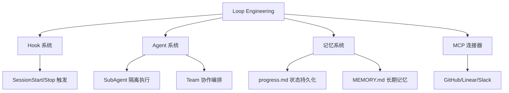

# 14 · Loop Engineering 循环工程

> 从"人手动驱动 Agent"进化为"设计系统来自动驱动 Agent"—— Loop Engineering 是 Prompt Engineering 的下一阶段。

---

## 1. 概述与设计哲学

### 1.1 什么是 Loop Engineering

> "You shouldn't be prompting coding agents anymore. You should be designing loops that prompt your agents." — Peter Steinberger

Loop Engineering 的核心思想：不再逐轮手动对话，而是构建一个自动化控制系统来发现工作、分配任务、检查结果、记录进展、决定下一步行动。

### 1.2 六大原语与 Jimi 实现

| # | 原语 | 职责 | Jimi 对应实现 |
|---|------|------|--------------|
| 1 | **Automations** | 按计划定时运行，自动发现和分流任务 | Hook 事件驱动 + `/loop` + `/goal` |
| 2 | **Worktrees** | 并行隔离，多个 Agent 不互相踩踏 | `WorktreeManager` + SubAgent 上下文隔离 |
| 3 | **Skills** | 固化项目知识，Agent 不用每次从零猜测 | `SkillRegistry` + `SKILL.md` |
| 4 | **Plugins/Connectors** | 通过 MCP 协议连接外部真实工具 | MCP (STDIO/HTTP) + Plugin 三层加载 |
| 5 | **Sub-agents** | Maker/Checker 分离，避免自己批改自己 | `SubAgentTool` + `TeamAgentTool` |
| 6 | **State/Memory** | 跨会话持久化状态 | `MEMORY.md` + Session JSONL + `progress.md` |

### 1.3 源码位置

| 模块 | 包路径 | 关键类 |
|------|--------|--------|
| Loop 核心 | `io.leavesfly.jimi.core.loop` | `LoopManager`、`GoalVerifier`、`LoopStateManager`、`WorktreeManager` |
| 命令处理 | `io.leavesfly.jimi.command.handlers` | `LoopCommandHandler`、`GoalCommandHandler` |
| 配置 | `io.leavesfly.jimi.config.info` | `LoopEngineeringConfig` |
| 状态模型 | `io.leavesfly.jimi.core.loop` | `LoopStatus`、`GoalVerification` |

---

## 2. 架构总览

```
┌─────────────────────────────────────────────────────────────────┐
│                      Loop Control Layer                          │
│  ┌──────────┐  ┌──────────┐  ┌──────────┐  ┌───────────────┐  │
│  │  /loop   │  │  /goal   │  │  Hooks   │  │ Cron/Schedule │  │
│  │ (cadence)│  │(condition)│  │ (event)  │  │  (external)   │  │
│  └────┬─────┘  └────┬─────┘  └────┬─────┘  └──────┬────────┘  │
│       └──────────────┴──────────────┴───────────────┘           │
│                              │                                   │
├──────────────────────────────┼───────────────────────────────────┤
│                      Agent Orchestration                         │
│  ┌──────────────┐  ┌────────────────┐  ┌─────────────────┐     │
│  │  SubAgentTool │  │ TeamAgentTool  │  │  AgentRegistry  │     │
│  │  (isolation)  │  │ (collaboration)│  │  (agent specs)  │     │
│  └──────┬───────┘  └───────┬────────┘  └────────┬────────┘     │
│         │                   │                     │              │
├─────────┴───────────────────┴─────────────────────┴──────────────┤
│                      Execution Layer                              │
│  ┌──────────┐  ┌──────────┐  ┌──────────┐  ┌──────────────┐    │
│  │ JimiEngine│  │ ToolReg  │  │ MCP Tools│  │ Git Worktree │    │
│  │  (ReAct)  │  │ (native) │  │ (remote) │  │  (isolation) │    │
│  └──────────┘  └──────────┘  └──────────┘  └──────────────┘    │
│                                                                   │
├───────────────────────────────────────────────────────────────────┤
│                      Persistence Layer                            │
│  ┌──────────┐  ┌──────────┐  ┌──────────┐  ┌──────────────┐    │
│  │MEMORY.md │  │Session   │  │ Skills   │  │ progress.md  │    │
│  │(long-term)│  │(.jsonl)  │  │(SKILL.md)│  │ (loop state) │    │
│  └──────────┘  └──────────┘  └──────────┘  └──────────────┘    │
└───────────────────────────────────────────────────────────────────┘
```

数据流转：

1. **触发层** — `/loop`、`/goal`、Hook 事件或外部 cron 触发任务
2. **编排层** — 将任务分派给 SubAgent 或 Team，各自在独立环境中执行
3. **执行层** — `JimiEngine` 走 ReAct 循环，调用工具完成工作
4. **持久层** — 将状态写入 `progress.md`，确保即使上下文被压缩也不丢进度

---

## 3. `/loop` — 定时循环调度

### 3.1 核心类：LoopManager

`LoopManager`（`io.leavesfly.jimi.loop.LoopManager`）是定时循环的核心管理器，使用 `ScheduledExecutorService` 按指定间隔重复提交 prompt 到引擎。

**关键字段：**

```java
@Service
public class LoopManager {
    private ScheduledExecutorService scheduler;
    private ScheduledFuture<?> currentLoop;
    private final AtomicBoolean running = new AtomicBoolean(false);
    private final AtomicBoolean paused = new AtomicBoolean(false);
    private final AtomicInteger iterationCount = new AtomicInteger(0);
}
```

**生命周期管理：**

| 方法 | 职责 |
|------|------|
| `startLoop(Duration, String, EngineClient)` | 创建调度器，按间隔重复执行 prompt |
| `stopLoop()` | 取消任务、关闭线程池、重置状态 |
| `pauseLoop()` | 设置暂停标记，执行时跳过 |
| `resumeLoop()` | 清除暂停标记 |
| `getStatus()` | 返回 `LoopStatus` 对象（含运行/暂停/迭代次数/下次执行时间） |

**迭代执行逻辑：**

```java
private void executeIteration() {
    if (paused.get()) {
        return;  // 暂停时跳过
    }
    int iteration = iterationCount.incrementAndGet();
    try {
        currentClient.runCommand(currentPrompt).block();
    } catch (Exception e) {
        // 不停止循环，继续下一次（容错设计）
    }
}
```

> 设计要点：单次迭代失败不会终止整个循环，确保 Loop 的鲁棒性。

### 3.2 命令处理：LoopCommandHandler

`LoopCommandHandler` 解析 `/loop` 命令并委托给 `LoopManager`：

```
/loop 5m 检查编译状态并修复错误
      ↓
解析 interval=5m, prompt="检查编译状态并修复错误"
      ↓
LoopManager.startLoop(Duration.ofMinutes(5), prompt, client)
```

**子命令：**

| 命令 | 行为 |
|------|------|
| `/loop <interval> <prompt>` | 启动循环 |
| `/loop stop` | 停止循环 |
| `/loop pause` | 暂停循环 |
| `/loop resume` | 恢复循环 |
| `/loop status` | 查看运行状态 |

**interval 格式支持**：`30s`、`5m`、`1h`、`2h30m`

### 3.3 LoopStatus 状态模型

```java
@Data @Builder
public class LoopStatus {
    private boolean running;
    private boolean paused;
    private int iterationCount;
    private String prompt;
    private Duration interval;
    private Instant startTime;
    private Instant nextExecutionTime;
    private LoopType type;  // INTERVAL 或 GOAL

    public enum LoopType {
        INTERVAL,  // /loop 模式
        GOAL       // /goal 模式
    }
}
```

---

## 4. `/goal` — 目标驱动迭代

### 4.1 设计原理

`/goal` 的核心机制是 **Maker/Checker 分离**：

- **执行者（Maker）**：使用主 Agent 的模型，向目标方向工作一步
- **验证者（Checker）**：使用独立的模型实例，严格评估目标条件是否满足

> "The model that wrote the code is way too nice grading its own homework." — Addy Osmani

### 4.2 GoalCommandHandler 执行流程

```
/goal 所有测试通过且覆盖率 > 80%
      ↓
┌─────────────────────────────────────────────┐
│ Phase 1: 初始化                              │
│   - 初始化 LoopStateManager 状态文件         │
│   - 设置安全限制（max-steps, timeout）       │
├─────────────────────────────────────────────┤
│ Phase 2: Goal Loop                           │
│   ┌─────────────────────────────────────┐   │
│   │ Step N:                              │   │
│   │   1. 执行者工作一步                   │   │
│   │   2. GoalVerifier 独立验证            │   │
│   │   3. 满足 → 结束 / 不满足 → 继续     │   │
│   └─────────────────────────────────────┘   │
│   (重复直到满足或达到安全限制)              │
├─────────────────────────────────────────────┤
│ Phase 3: 更新状态文件                        │
└─────────────────────────────────────────────┘
```

**安全限制（来自 LoopEngineeringConfig）：**

| 参数 | 默认值 | 说明 |
|------|--------|------|
| `goalMaxIterations` | 50 | 最大迭代次数 |
| `goalMaxTokens` | 500,000 | Token 预算上限 |
| `goalVerifyInterval` | 1 | 每 N 步验证一次 |
| `goalTimeoutMinutes` | 60 | 超时自动停止 |

### 4.3 GoalVerifier — 独立验证器

`GoalVerifier`（`io.leavesfly.jimi.loop.GoalVerifier`）是验证者的核心实现：

```java
@Service
public class GoalVerifier {
    private static final String VERIFIER_SYSTEM_PROMPT = """
        你是一个严格的目标条件验证者。你的唯一任务是评估给定的目标条件是否已经被满足。
        规则：
        1. 只基于提供的"当前状态"信息进行判断
        2. 不要猜测、不要假设、不要编造信息
        3. 如果信息不足以判断，回答"未满足"
        4. 返回严格的 JSON 格式
        """;

    public Mono<GoalVerification> verify(String goalCondition, String currentState) {
        // 1. 获取独立的验证者 LLM（可配置不同模型）
        LLM verifierLLM = getVerifierLLM();
        // 2. 构造验证 prompt
        // 3. 调用 LLM 获取 JSON 响应
        // 4. 解析为 GoalVerification
    }
}
```

**关键设计：**

- **模型分离**：通过 `config.getGoalVerifierModel()` 可以为验证者指定不同的模型
- **保守策略**：解析失败或无响应时，默认返回"未满足"，防止误通过
- **JSON 容错**：支持 ````json```` code fence、裸 JSON、花括号提取等多种格式

### 4.4 GoalVerification 结果模型

```java
@Data @Builder
public class GoalVerification {
    private boolean satisfied;  // 目标条件是否已满足
    private String reason;      // 判断理由

    public static GoalVerification satisfied(String reason) { ... }
    public static GoalVerification notSatisfied(String reason) { ... }
}
```

---

## 5. Worktrees — 并行隔离

### 5.1 为什么需要文件系统级隔离

当多个 Agent 并行修改同一仓库时，仅有上下文隔离（独立 Context、独立 ToolRegistry）不够——Agent A 写的文件可能被 Agent B 覆盖。Git Worktree 提供真正的文件系统隔离。

### 5.2 WorktreeManager 核心实现

`WorktreeManager`（`io.leavesfly.jimi.loop.WorktreeManager`）管理 Git Worktree 的完整生命周期：

```java
@Service
public class WorktreeManager {
    // 创建隔离 worktree
    public Path createWorktree(String agentName, Path baseDir) throws IOException;
    // 清理 worktree + 删除临时分支
    public void cleanupWorktree(Path worktreeDir, Path baseDir);
    // 合并 worktree 变更到目标分支
    public MergeResult mergeWorktree(Path worktreeDir, Path baseDir, String targetBranch);
    // 列出活跃 worktrees
    public List<WorktreeInfo> listWorktrees(Path baseDir);
}
```

**创建流程：**

```
createWorktree("dev-auth", /project)
    ↓
1. 检查是否为 git 仓库
2. 生成分支名: jimi/dev-auth-a1b2c3d4
3. 解析 worktree 目录: .jimi/worktrees/dev-auth
4. 执行: git worktree add -b <branch> <dir> HEAD
5. 返回 worktree 工作目录路径
```

**合并流程：**

```
mergeWorktree(worktreeDir, baseDir, "main")
    ↓
1. 获取 worktree 分支名
2. checkout 目标分支
3. git merge --no-ff <branch>
4. 返回 MergeResult (success / conflict)
```

### 5.3 与 Team 协作的集成

在 Agent Team 配置中通过 `isolation: worktree` 启用：

```yaml
team:
  teammates:
    - teammate_id: dev-auth
      agent_path: agents/developer
      isolation: worktree     # WorktreeManager 为其创建独立 worktree
    - teammate_id: reviewer
      agent_path: agents/reviewer
      isolation: shared       # 共享主 worktree（适合只读操作）
```

**协作流程图：**

```
┌─────────────┐     ┌─────────────────────────────────────┐
│  Team Lead  │     │          Git Repository              │
└──────┬──────┘     │  main ──────────────────────►        │
       │            │    │                                  │
       │ spawn      │    ├── jimi/dev-auth-a1b2 (Agent A)  │
       ├───────────►│    │                                  │
       │            │    ├── jimi/dev-api-c3d4  (Agent B)  │
       ├───────────►│    │                                  │
       │ merge      │    └── (shared) reviewer reads main  │
       ▼            └──────────────────────────────────────┘
  [PR / Commit]
```

---

## 6. 状态持久化 — LoopStateManager

### 6.1 核心理念

> Agent 忘了，但文件不会忘。

Loop Engineering 的"脊柱"是状态文件。即使 Agent 的上下文被压缩或会话重置，它仍然可以从 `.jimi/progress.md` 恢复进度继续工作。

### 6.2 LoopStateManager 实现

`LoopStateManager`（`io.leavesfly.jimi.loop.LoopStateManager`）管理状态文件的 CRUD：

| 方法 | 职责 |
|------|------|
| `readState(workDir, stateFile)` | 读取状态文件内容 |
| `writeState(workDir, stateFile, content)` | 写入状态文件（自动创建父目录） |
| `appendTask(workDir, stateFile, desc, completed)` | 追加任务条目 |
| `updateTask(workDir, stateFile, taskId, completed)` | 更新任务状态 ([ ] ↔ [x]) |
| `initializeState(workDir, stateFile, goalCondition)` | 初始化新的状态报告 |
| `updateStats(workDir, stateFile, iterationCount)` | 更新统计信息 |

### 6.3 状态文件格式

```markdown
# Loop Progress

## 当前目标
- **开始时间**: 2025-06-20 09:00
- **目标**: 所有测试通过且覆盖率 > 80%

## 已完成
- [x] #1: 修复 AuthService NPE
- [x] #2: 补充 UserController 单元测试

## 进行中
- [ ] #3: 补充 MemoryStore 单元测试

## 待处理
- [ ] CI 告警: SkillLoader 未覆盖分支

## 统计
- 总迭代: 3
- Token 消耗: 约 45,000
```

### 6.4 任务正则解析

状态文件中的任务行通过正则解析：

```java
private static final Pattern TASK_PATTERN = 
    Pattern.compile("^- \\[([ xX])\\] #(\\d+): (.+)$");
```

匹配格式：`- [ ] #1: 任务描述` 或 `- [x] #1: 任务描述`

---

## 7. 配置体系

### 7.1 LoopEngineeringConfig 完整字段

`LoopEngineeringConfig`（`io.leavesfly.jimi.config.info.LoopEngineeringConfig`）：

```java
@Data @Builder
public class LoopEngineeringConfig {
    // 总开关
    private boolean enabled = true;

    // /loop 调度
    private int maxConcurrentLoops = 3;
    private int scheduleThreadPoolSize = 2;

    // /goal 控制
    private int goalMaxIterations = 50;
    private long goalMaxTokens = 500000;
    private int goalVerifyInterval = 1;
    private int goalTimeoutMinutes = 60;
    private String goalVerifierModel = "";  // 空则用默认模型

    // Worktree 隔离
    private boolean worktreeEnabled = true;
    private String worktreeBaseDir = ".jimi/worktrees";
    private boolean worktreeAutoCleanup = true;
    private String worktreeBranchPrefix = "jimi/";

    // 状态持久化
    private String defaultStateFile = ".jimi/progress.md";
    private boolean stateAutoUpdate = true;
}
```

### 7.2 YAML 配置示例

在 `~/.jimi/config.yml` 中的 `loop_engineering` 节：

```yaml
loop_engineering:
  enabled: true
  # /loop 调度
  max_concurrent_loops: 3
  schedule_thread_pool_size: 2
  # /goal 控制
  goal_max_iterations: 50
  goal_max_tokens: 500000
  goal_verify_interval: 1
  goal_timeout_minutes: 60
  goal_verifier_model: "gpt-4o-mini"  # 验证者可使用轻量模型
  # Worktree
  worktree_enabled: true
  worktree_base_dir: ".jimi/worktrees"
  worktree_auto_cleanup: true
  worktree_branch_prefix: "jimi/"
  # 状态持久化
  default_state_file: ".jimi/progress.md"
  state_auto_update: true
```

### 7.3 配置注入链

```
config.yml → JimiConfig.loopEngineering → JimiConfiguration @Bean → LoopEngineeringConfig
                                                                          ↓
                                                   注入到 LoopManager / GoalVerifier /
                                                   LoopStateManager / WorktreeManager
```

---

## 8. Hook 联动 — 事件驱动自动化

Loop Engineering 与 Hook 系统的协作是实现"全自动"的关键。

### 8.1 SessionStart 自动 Triage

```yaml
name: auto-triage-ci-failures
trigger:
  type: SessionStart
execution:
  type: script
  script: |
    cd ${JIMI_WORK_DIR}
    FAILURES=$(gh run list --status failure --limit 5 --json name,conclusion 2>/dev/null)
    if [ -n "$FAILURES" ]; then
      echo "{\"ci_failures\": $FAILURES}"
    fi
  timeout: 30
```

### 8.2 Goal 完成后自动创建 PR

```yaml
name: auto-pr-on-goal-complete
trigger:
  type: Stop
  matcher: ".*goal.*complete.*"
execution:
  type: composite
  steps:
    - type: script
      script: |
        cd ${JIMI_WORK_DIR}
        BRANCH=$(git rev-parse --abbrev-ref HEAD)
        if [ "$BRANCH" != "main" ]; then
          git add -A && git commit -m "feat: auto-fix by Jimi loop"
          git push origin $BRANCH
        fi
    - type: agent
      prompt: 使用 GitHub MCP 工具为当前分支创建 Pull Request。
```

### 8.3 外部调度集成

```bash
# crontab: 每天 9 点自动 triage
0 9 * * * cd /project && jimi --non-interactive --skill daily-triage

# GitHub Actions
on:
  schedule:
    - cron: '0 1 * * *'
jobs:
  triage:
    steps:
      - run: jimi --non-interactive --prompt "分析最近 24 小时变更"
```

---

## 9. 组合实战

### 9.1 Daily Triage Loop

```bash
# 方式 1: 目标驱动
/goal CI 全绿且无 Critical 级别 Issue

# 方式 2: 定时循环
/loop 4h 执行 daily-triage 技能，处理新发现的问题

# 方式 3: 非交互模式
jimi --non-interactive --skill daily-triage
```

### 9.2 Feature Development Loop

```bash
/goal 实现用户注册功能，包含：\
  1) POST /api/users/register 接口 \
  2) 参数校验（邮箱格式、密码强度）\
  3) 单元测试覆盖率 > 90% \
  4) 接口文档更新
```

Loop 自动编排：

```
迭代 1: Explorer 分析现有代码结构
迭代 2: Implementer 创建 Controller + Service
迭代 3: Reviewer 发现缺少参数校验
迭代 4: Implementer 添加校验逻辑
迭代 5: Tester 编写单元测试
迭代 6: Reviewer 确认通过 → 验证者 satisfied=true → Loop 结束
```

### 9.3 Continuous Refactoring Loop

```bash
/loop 10m 从以下列表中选择一项执行：\
  1. 找到最长的方法，拆分它 \
  2. 找到重复代码，抽取公共方法 \
  3. 找到缺少测试的公共方法，补充测试 \
  每次只做一项，做完后运行 mvn test 确保不破坏现有功能
```

---

## 10. 最佳实践与注意事项

### 10.1 设计原则

1. **从小开始，逐步扩展** — 先用 `/goal` 验证单任务，再组合为 `/loop`，最后 cron 无人值守
2. **始终保留人类审查点** — Loop 越快越需要 review，关键变更设 Hook 要求确认
3. **Token 成本意识** — 合理设置 `max-iterations` 和 token 预算，使用 Skills 减少重复
4. **Maker/Checker 分离** — 验证者使用不同模型或不同 temperature，验证条件要可量化

### 10.2 常见反模式

| 反模式 | 问题 | 改正 |
|--------|------|------|
| Loop 不设限制 | Token 爆炸、无限循环 | 设置 `goalMaxIterations` 和 `goalTimeoutMinutes` |
| 单 Agent 做全部 | 上下文膨胀、质量下降 | 拆分为 SubAgent / Team |
| 不用状态文件 | 上下文压缩后丢失进度 | 始终启用 `stateAutoUpdate` |
| 循环间隔太短 | 浪费资源、产出低质量 | 10 秒以下的间隔几乎无意义 |
| 共享工作目录 | 多 Agent 文件冲突 | 使用 `isolation: worktree` |

### 10.3 调试技巧

```bash
# 查看 Loop 日志
tail -f ~/.jimi/logs/jimi.log | grep -i "loop\|goal"

# 查看状态文件变化
watch -n 5 cat .jimi/progress.md

# 检查活跃的 worktree
git worktree list

# Token 消耗统计
/stats
```

---

## 11. 与其他模块的关系



| 关联模块 | 交互方式 | 参考 Wiki |
|---------|----------|-----------|
| Hook 系统 | 事件触发 Loop / Loop 结果触发 Hook | [07 · Hooks](07-Hooks自动化系统.md) |
| Agent 系统 | SubAgent/Team 提供并行隔离执行 | [03 · Agent](03-Agent多智能体系统.md) |
| 记忆系统 | `LoopStateManager` 写状态文件 | [10 · 记忆管理](10-记忆管理与会话机制.md) |
| MCP | Connector 让 Loop 连接真实外部工具 | [11 · MCP](11-MCP协议集成.md) |
| Skills | 固化项目知识，避免 Loop 每轮从零推导 | [06 · Skills](06-Skills技能包系统.md) |

---

## 12. 扩展参考

- 用户视角文档：[docs/LOOP_ENGINEERING.md](../docs/LOOP_ENGINEERING.md)
- 源码入口：`src/main/java/io/leavesfly/jimi/core/loop/`
- 配置类：`src/main/java/io/leavesfly/jimi/config/info/LoopEngineeringConfig.java`
- 命令处理：`src/main/java/io/leavesfly/jimi/command/handlers/LoopCommandHandler.java`、`GoalCommandHandler.java`
